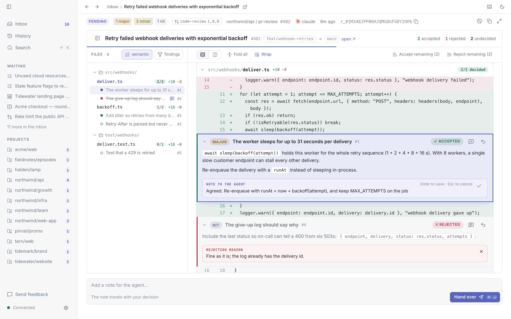
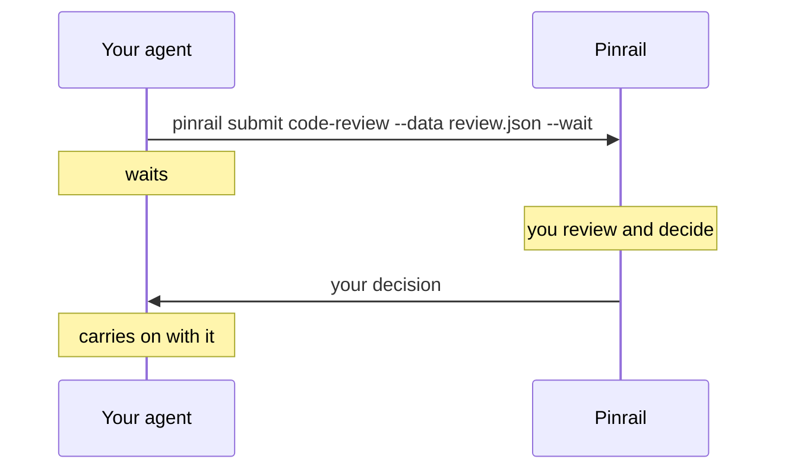
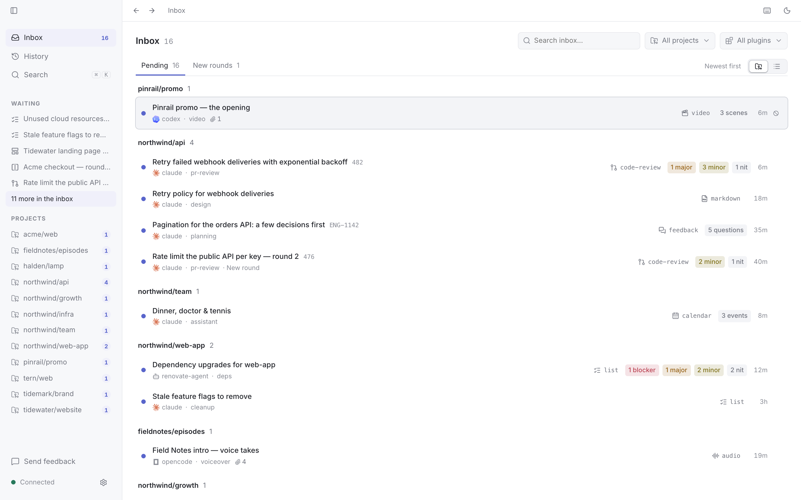
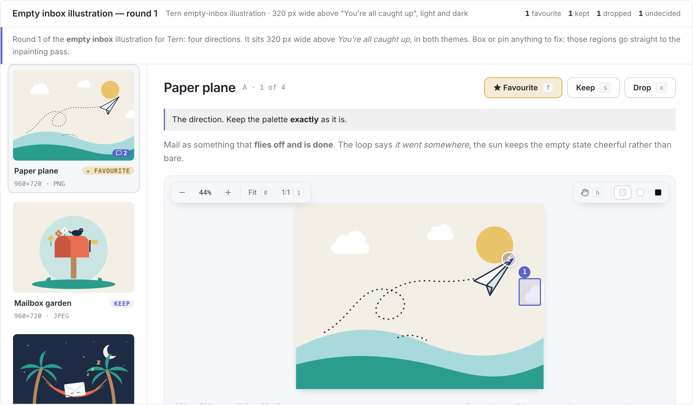
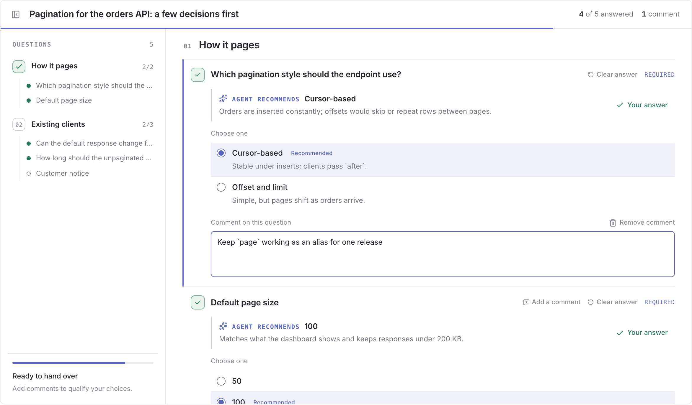
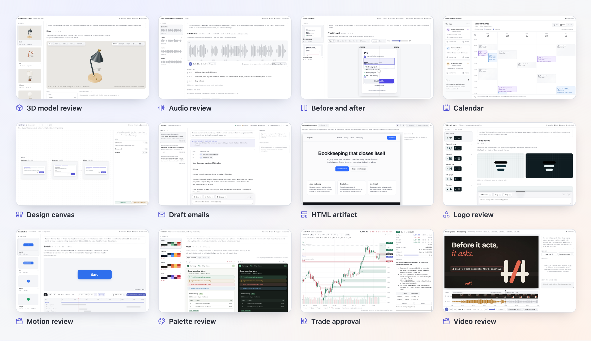

# Pinrail

[Website](https://pinrail.dev) · [Download](https://pinrail.dev/download/) ·
[Documentation](https://pinrail.dev/docs/) ·
[Plugins](https://github.com/forgeplane/pinrail-plugins)

Pinrail is a desktop app where your coding agents ask you before they act.
You review what an agent proposes in a view made for it, and the agent
carries on with your decision.



Pinrail works with any agent that can run a command, such as Claude Code,
Codex, Cursor or OpenCode. It runs on macOS and Linux, and Windows support
is coming. Pinrail is in early development, so expect rough edges and
changes between releases.

## Why

Agents are good at doing the work, but some steps need a person: a comment
posted under your name, an email to a customer, a change to production.
Approving those steps in a chat means reading a wall of text and typing your
answer back. Pinrail gives each of these moments a proper review:

- **The agent decides when to ask.** Its instructions name the steps that
  need you, so it asks at those steps and nowhere else.
- **Each review has a view made for its content.** A code review shows the
  diff with the agent's findings on it. A set of generated images shows the
  images, and you draw a box on the part that should change.
- **Your decision is structured.** The agent gets back what you accepted,
  what you rejected and your notes, as Markdown it can act on or JSON for a
  script.
- **Everything stays on your machine.** The app serves its API on loopback
  only, and keeps your reviews and decisions locally.

## How it works



When the agent reaches a step that needs you, it runs the `pinrail` command
with a review: the plugin to show it with, a title and a JSON payload.

```sh
pinrail submit code-review --title "Retry failed webhook deliveries" \
  --data findings.json --wait
```

Pinrail notifies you, and the review waits in your inbox, grouped by
project.



You open it, and decide in the plugin's view. In the code review at the top
of this page, you accept or reject each of the agent's findings, and write a
note to the agent.

When you hand the review over, the command prints your decision and exits,
and the agent carries on:

```txt
r_01K5R2 · decided · Retry failed webhook deliveries
code-review · decided by maya at 2026-09-23 10:14

- **#1 accepted** `src/deliver.ts:42` — The worker sleeps for up to 31 seconds per delivery (major)
  > Agreed. Re-enqueue with runAt = now + backoff(attempt)
- **#4 rejected** `src/log.ts:18` — The give-up log should say why (nit)
  > Fine as it is; the log already has the delivery id.

Undecided: #2, #3, #5
```

The command's exit code says how the review ended: decided, discarded with
an instruction to stop, withdrawn or expired. When you ask for changes, the
agent submits a new round, and the app shows your earlier verdicts beside
it.

## Getting started

1. **Install the app** from the [download page](https://pinrail.dev/download/)
   or the [latest release](https://github.com/forgeplane/pinrail/releases/latest).
   On macOS, it is signed and notarized.
2. **Follow the setup** that opens the first time. It installs the `pinrail`
   command, adds Pinrail's skill to the agents it finds on your computer,
   and installs the recommended plugins.
3. **Ask your agent** for something, in your own words:

   ```txt
   Ask me through Pinrail which TODOs in this repository to tackle first.
   ```

   Or ask it where Pinrail would help in your project:

   ```txt
   Look at this project and suggest where you should ask me through Pinrail before you act.
   ```

[Your first review](https://pinrail.dev/docs/getting-started/first-review/)
walks through this, and
[Instructing an agent](https://pinrail.dev/docs/agents/instructing/) shows
how to make an agent ask at the steps you choose, every time.

## Plugins

Each kind of review is a plugin: the payload an agent sends, the decision
you give back, and the view you decide in. Five core plugins come with the
app:

| Plugin | Review |
|---|---|
| [`code-review`](plugins/code-review) | A diff with the agent's proposed review comments, each accepted, rejected or edited. |
| [`list`](plugins/list) | Items grouped under headings, each accepted or rejected with a note. |
| [`feedback`](plugins/feedback) | Questions answered in one pass: choices, yes or no, and free text. |
| [`markdown`](plugins/markdown) | A document, such as a plan or a spec, read and commented on section by section. |
| [`image`](plugins/image) | Generated images to choose between, with boxes and pins on what to change. |

<table>
  <tr>
    <td></td>
    <td></td>
  </tr>
</table>

Sample plugins in
[forgeplane/pinrail-plugins](https://github.com/forgeplane/pinrail-plugins)
show what else a plugin can do. They cover HTML pages, emails, calendars,
logos, colour palettes, 3D models, animations, audio, video, design
canvases, before-and-after comparisons and trades. Each one is released as
a zip, which you install in the app's *Settings › Plugins*.



### Writing a plugin

A plugin is a manifest, two JSON schemas and an HTML view, with no build step
needed. `pinrail plugins new <name>` creates one, and the plugin SDK,
[`pinrail-sdk`](https://www.npmjs.com/package/pinrail-sdk), runs its view in a
browser without the app and tests it with Playwright. Views can also be
built with React, Vue, Svelte or any other framework. See
[Writing a plugin](https://pinrail.dev/docs/building/writing/).

## Repository

| Directory | Contents |
|---|---|
| [`desktop/`](desktop/) | The app: a Rust core (API, storage, plugins), a Tauri shell and a React UI. |
| [`cli/`](cli/README.md) | The `pinrail` command that agents run. |
| [`plugins/`](plugins/README.md) | The core plugins. |
| [`sdk/`](sdk/README.md) | The plugin SDK, its development shell and its test harness. |
| [`skill/`](skill/) | The skill that teaches an agent to use Pinrail. |
| [`e2e/`](e2e/README.md) | End-to-end tests of the CLI and the app's UI against the headless core. |
| [`docs/`](docs/) | The documentation, published on the website. |
| [`website/`](website/) | The website. |

## Development

Node is pinned in `mise.toml`, which `mise install` sets up, and Rust in
`rust-toolchain.toml`, which rustup reads on its own.

```sh
mise run dev:desktop        # the app with live reload
mise run test               # every test suite
mise run lint               # rustfmt, clippy, the type check and the licences, as CI runs them
```

[CONTRIBUTING.md](CONTRIBUTING.md) describes each test suite and how to run
it. Read it before you open a pull request. To report a vulnerability,
follow [SECURITY.md](SECURITY.md).

## License

Pinrail is licensed under the [Apache License 2.0](LICENSE). See
[`NOTICE`](NOTICE) for the copyright and the third-party notices.
