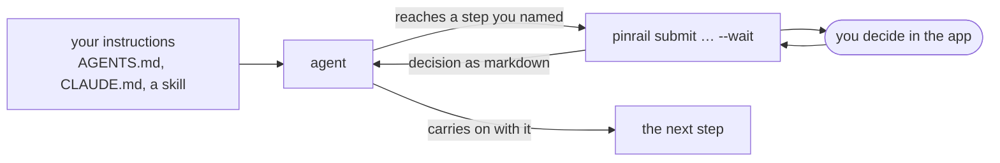

Pinrail never interrupts an agent on its own. The agent decides when to ask, because its instructions tell it to: "before posting review comments, submit them to Pinrail and wait." This page shows where those instructions go, what makes them work, and a template to start from.



## Where instructions go

Put them wherever your agent already reads its standing instructions. The words are the same for every agent; only the file changes.

| Agent | Where |
|---|---|
| Claude Code | `CLAUDE.md` in the repository, or a skill |
| Codex, Cursor, OpenCode, and others | `AGENTS.md` in the repository |
| Gemini CLI | `GEMINI.md` |
| A CI job or script | The prompt or the script itself. See [Scripts and CI](/docs/agents/workflows/). |

Instructions in the repository apply to everyone who runs an agent there. Instructions in your personal settings apply to you, everywhere.

## What good instructions say

An agent follows instructions literally. Say four things, plainly:

1. **When to ask.** Name the moment: *before posting review comments*, *before sending email*, *before deleting anything in production*. A vague rule ("ask when unsure") gets you asked about everything or nothing.
2. **What to send.** Name the plugin and describe the payload in a sentence, so the agent knows what to put in it. The agent can read the exact shape, with an example, from `pinrail plugins describe <plugin>`; each [plugin page](/docs/plugins/) has it too.
3. **The command.** Give it exactly, with `--wait` so the agent blocks until you decide, and `--format markdown` so the answer reads as prose.
4. **What to do with the answer.** Which verdicts to act on, what notes mean, what to do with anything undecided, and what to do if you say stop.

:::tip[Let the agent read markdown]
`--format markdown` returns the decision as a short document the agent reads like any other text: the title, who decided, and each verdict with its note. Set `PINRAIL_FORMAT=markdown` in the agent's environment to make it the default.
:::

## A template

Start from this and fill in the parts in angle brackets. The [plugin pages](/docs/plugins/) each have a version tailored to that plugin.

```md title="AGENTS.md"
## Ask before <the step>

Before you <the step>, ask me through Pinrail and wait for my decision.
Don't ask in chat and don't go ahead without an answer.

1. Write <what you're proposing> to a JSON file for the `<plugin>` plugin:
   <one sentence on the payload's shape>. `pinrail plugins describe <plugin>
   --format markdown` has the schema and an example. Check the file with
   the command below and `--dry-run` in place of `--wait`.
2. Run:
   pinrail submit <plugin> --title "<a title I'll recognise>" \
     --origin repo=<owner/repo>,ref=<branch or PR> \
     --data <file>.json --wait --format markdown
3. Act on the decision: <which verdicts to act on, and how to use notes>.
   Treat anything undecided as not approved.
4. If I ask for changes, make them and submit again with
   `--revises <the review's id>`, so I see the new round beside the old one.
5. If the command exits 5, I discarded the review: stop the work it was
   about, tell me my reason, and don't ask again.
```

## Handle every outcome

`pinrail submit --wait` blocks until the review ends, then exits with a code that says how. Tell your agent what each one means for it:

| Exit | The review | The agent should |
|---|---|---|
| `0` | Was decided. | Act on the decision it printed. |
| `3` | Was withdrawn, or expired before anyone decided. | Stop, and say nobody decided. |
| `4` | Is still waiting: `--timeout` ran out. | Carry on with other work and check later. See below. |
| `5` | Was discarded: you said no, and stop. | Stop the work, report your reason, and not ask again. |
| `1`, `2` | Could not be submitted. | Report the error. A `2` means the payload failed the plugin's schema. |

:::caution[Exit 5 means stop]
Discarding is your "no, and stop". An agent that gets exit 5 should drop the work the review was gating, not retry it and not submit a new round. Say so in your instructions.
:::

## When you're away

An agent does not have to block forever. With `--timeout`, it stops waiting after that many seconds and exits 4, and the review stays in your inbox:

```sh
pinrail submit list --title "Nightly cleanup" --data items.json --wait --timeout 600
```

Decide whenever you are back. The agent picks up your decision the next time it looks:

```sh
pinrail wait <id>    # returns at once with the decision, now that there is one
pinrail show <id>    # where the review stands, and its decision
```

## Rounds

When you ask for changes, the agent makes them and submits a new round that names the one it answers:

```sh
pinrail submit review --title "Dedup tickets on save — round 2" --revises <id> --data review.json --wait --format markdown
```

The app shows the new round with your previous verdicts beside each item, so you only review what changed. Every round is kept. `pinrail rounds <id>` prints them all, oldest first.

## Several questions at once

Questions that belong together go in one review: the `feedback` plugin takes several groups of questions answered in one pass, and `list` groups items under headings. When the questions are independent, or need different plugins, the agent submits each one without `--wait`, then waits on them:

```sh
a=$(pinrail submit review --title "Dedup tickets on save" --data review.json | jq -r .id)
b=$(pinrail submit email --title "Renewal emails" --data drafts.json | jq -r .id)

pinrail wait "$a" --format markdown   # returns when this one is decided
pinrail wait "$b" --format markdown   # at once, if you decided it meanwhile
```

The reviews are all pending together, so you can decide them in any order. Waiting on each in turn ends when the last one is decided, and each `wait` exits with its own [exit code](/docs/agents/cli/#exit-codes), so the agent knows how each one ended.

:::tip[Act on each answer as it comes]
An agent that can run commands in the background, such as Claude Code, can start one `pinrail wait` per review and act on each decision as soon as it arrives, without waiting for the rest.
:::

## Files

When what you review is a file, such as a model, a PDF or a recording, tell the agent to send the file itself with the plugin that takes it, not a path you would have to open or the file inlined in the payload:

```md title="AGENTS.md"
Send the files with `--artifact <path>`, one per file, and name each in the
payload as {"$artifact": "<file name>"}. `pinrail plugins describe <plugin>`
says which kinds the plugin takes and how big.
```

The review shows every file it carries by name and size, and you can save any of them.

## Check that it works

Ask your agent to do the step, and watch for the review in your inbox. If it doesn't arrive:

- **The agent went ahead without asking.** Make the "when" more specific, and move it higher in the file.
- **The command failed.** Run `pinrail list` yourself. If it cannot reach the app, see [Finding the app](/docs/agents/cli/#finding-the-app).
- **Exit 2.** The payload did not match the plugin's schema. The error names the field. Tell the agent to check its payload with `--dry-run` before it asks, and to read the schema from `pinrail plugins describe <plugin>`.
