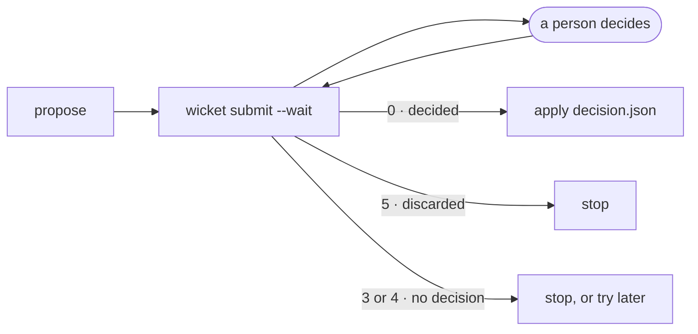

An agent reads a decision as markdown. A script wants something it can branch on: JSON, an exit code, and a file it already knows how to read. Wicket gives it all three.

## The shape of a gated step

```sh title="apply-with-approval.sh"
#!/usr/bin/env bash
set -euo pipefail

./propose-changes > proposals.json            # what the step wants to do

status=0
wicket submit list --title "Prune stale branches in acme/api" \
  --origin repo=acme/api,workflow=prune,run_id="$RUN_ID" \
  --data proposals.json --wait --decision-out decision.json > review.json || status=$?

case $status in
  0) ./apply-decisions decision.json ;;        # decided: act on the verdicts
  5) echo "Discarded: $(jq -r .discarded_reason review.json)"; exit 1 ;;
  *) echo "No decision (exit $status)"; exit 1 ;;
esac
```

:::caution[set -e and exit codes]
With `set -e`, a non-zero exit from `wicket` ends the script before you can branch on it. Capture the code with `|| status=$?`, as above, or run the command as the condition of an `if`.
:::



## Reading the decision

`--decision-out <file>` writes the decision's data, the part the plugin defines, to a file, so a step that already reads a decisions file keeps working. It is always JSON, and it is written only when the review was decided.

For the built-in [List](/docs/plugins/list/) plugin, acting on accepted items is a line of `jq`:

```sh
jq -r '.decisions[] | select(.action == "accept") | .id' decision.json | while read -r id; do
  ./apply "$id"
done
```

Everything else about the review, who decided, when, and their note to the agent, is in the review printed on stdout.

## Running in CI

A CI runner has no Wicket app on it. Point the CLI at a machine that has one, reachable from the runner:

```sh
export WICKET_URL=https://wicket.internal.example
```

Or start the app's server headless on the runner itself, when the person deciding can reach it:

```sh
export WICKET_SERVER_CMD='wicket-desktop --headless'   # Linux, from the .deb or .rpm
```

`submit` starts it if nothing is running. It runs detached and logs to `server.log` in its data directory.

:::note
Wicket's server listens on your machine's loopback address by default. Exposing it to a network is a decision about who can submit reviews and see them. Put it behind something that authenticates.
:::

## Don't block the pipeline

A job that waits on a person can wait a long time. Two ways to keep it bounded:

- **`--timeout <seconds>`** gives up after that long with exit 4. The review stays pending, and a later job can pick it up with `wicket wait <id>`.
- **`--expires-at <time>`** closes the review if nobody decides in time. Its waiter exits 3.

For a step that should not hold a runner at all, split it in two: submit without `--wait` and store the id, then have a later job, or a scheduled one, run `wicket wait <id>` and apply the decision.

## Label reviews so you can find them

`--origin` tells the app where a review comes from. It groups reviews by project in the inbox, links back to the run, and lets you filter:

```sh
--origin repo=acme/api,workflow=prune,run_id=$RUN_ID,ref=main,url=$RUN_URL
```

```sh
wicket list --repo acme/api --workflow prune --status pending
```

`--requested-by` (or `WICKET_REQUESTED_BY`) names the job on every review it creates, so the person deciding knows which pipeline is asking.
