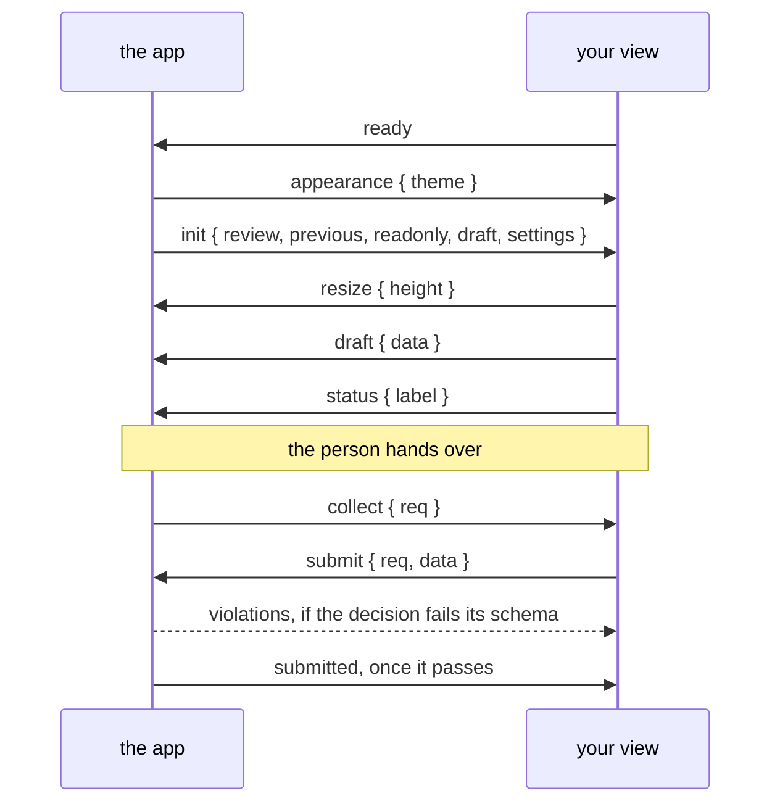

A view and the app talk over `postMessage`. The SDK, `/sdk/v1/pinrail-plugin.js`, speaks this protocol for you, and most plugins never see a raw message. Read this page when you want to know exactly what happens, or to write a view without the SDK.

## Messages

Every message is a JSON object with the protocol version and a type:

```json
{
  "pinrail": 1,
  "type": "draft",
  "data": { "decisions": [] }
}
```

The view announces itself with `ready`, and the app answers with `init`. With the SDK, `Pinrail.connect` sends `ready`, and a document calls it once. From then on, either side can send. A view sends `ready` once: a second `ready` from the frame means another page has taken the view's place, and the app sends nothing more to that frame. The app accepts messages only from the view's own frame. The view should accept messages only from the app: it checks that `event.source` is `window.parent`, and after `init`, that `event.origin` equals the `shell_origin` that `init` gives.



## From the app to your view

| Type | Fields | When |
|---|---|---|
| `init` | `review`, `previous`, `readonly`, `draft`, `settings`, `shell_origin`, `capabilities` | In answer to `ready`. It comes again, with `readonly: true`, when the review stops being pending while the view is open, for example when the agent withdraws it. After the view's own hand-over, `submitted` comes instead. |
| `attachment` | `req`, `ok`, and `name`, `media_type`, `size`, `bytes`; or `error` | The answer to the view's `attachment`, with the same `req`. `bytes` is an `ArrayBuffer`, transferred. |
| `collect` | `req` | The person pressed the hand-over button, or <kbd>⌘↵</kbd>. The view answers with `submit` or `defer` and the same `req`. |
| `violations` | `errors: [{ path, message }]` | A submitted decision failed the decision schema. |
| `submitted` | `decision` | The decision was accepted. The app then returns to the inbox and closes the view, so there is no need to show the decision. When the person opens the review again, `init` comes with `readonly: true` and the decision. |
| `appearance` | `theme: "dark" \| "light"` | Before `init`, and whenever the app's theme changes. |
| `settings` | `settings`; or `req`, `ok`, and `errors` when not `ok` | The plugin's own settings changed, in the app or from a view. With `req`, the answer to the view's `settings_set`: `ok: true` when the app kept the change, or `ok: false` and the errors when the settings schema refused it. |
| `key` | `key`, `code`, `metaKey`, `ctrlKey`, `altKey`, `shiftKey` | A shortcut the manifest declares, pressed while the app, not the frame, had focus. |

### `init`

`init` carries everything the view needs to render.

| Field | Type | Meaning |
|---|---|---|
| `review` | object | The review, with the fields below. |
| `previous` | object or `null` | The round this review revises, with the same fields and its decision, so you can show earlier verdicts beside the new ones. |
| `readonly` | boolean | `true` whenever the review is not pending. |
| `draft` | any or `null` | What the view last posted as a draft for this review. |
| `settings` | object | The plugin's own settings: every key the manifest declares, with its current value. |
| `shell_origin` | string | The app's origin. Accept messages from it alone. |
| `capabilities` | string array | What the app can do beyond the messages on this page. It is empty in this version; a later addition is named here, so a view can tell whether the app it runs in has it. |

`review` and `previous` have these fields, and no others:

| Field | Type | Meaning |
|---|---|---|
| `id` | string | The review's id. |
| `title` | string | The title the agent gave it. |
| `status` | string | `pending`, `decided`, `withdrawn`, `discarded` or `expired`. |
| `created_at` | string | When the agent sent it, as an RFC 3339 timestamp. |
| `payload` | any | The payload, as the payload schema describes it. |
| `attachments` | array | The files it carries, each with its `name`, `size`, `media_type` and `sha256`. |
| `decision` | object or `null` | Once the review is decided: `data`, the decision itself, and `decided_by` and `decided_at`. |

`previous` and `draft` can come from an earlier release of the plugin, because a pending review moves to a newer release when it is opened. Check their shape before you use them, and fall back to an empty view when they do not match.

A review is read-only for one of four reasons, and `review.status` says which:

| `review.status` | Meaning |
|---|---|
| `decided` | A decision was handed over. It is in `review.decision`. |
| `withdrawn` | The agent took the review back before anyone decided. |
| `discarded` | The person said no and told the agent to stop. |
| `expired` | The review passed its expiry without a decision. |

Render all four the same way: what was there, and nothing to submit.

### `collect`

`collect` asks for the decision. Answer it once, with `submit` and the same `req`, or with `defer` when there is nothing to hand over yet: an answer is missing, or the view shows what would be sent and waits for the person to confirm. The next press of the button is a new request, with a new `req`.

The app accepts one answer per request, and only for the request that is open. A `submit` the app did not ask for, a second answer to one request, and an answer that comes after the app stopped waiting all decide nothing. The app stops waiting after a minute, when the frame reloads, and when the review ends.

With the SDK, `onCollect` returns the decision, and the SDK sends the answer.

:::note
A view never draws its own submit button. The app puts one below every review, in the same place for every plugin, so nothing leaves on a single click and the person always knows where to look.
:::

### `violations`

The app validates every decision against the plugin's decision schema before the agent sees it. When one fails, the errors come back with a [JSON Pointer](https://datatracker.ietf.org/doc/html/rfc6901) into the rejected decision:

```json
{
  "pinrail": 1,
  "type": "violations",
  "errors": [
    {
      "path": "/decisions/0/action",
      "message": "\"later\" is not one of [\"close\",\"keep\"]"
    }
  ]
}
```

Show them next to the fields they name, and let the person hand over again.

### `key`

A shortcut you declare in the manifest reaches your view even when the person pressed it with the app in focus. The SDK dispatches it as a `keydown` on your document, marked `pinrailForwarded: true`, so the listener you already have handles both. See [Settings and keys](/docs/building/settings-and-keys/#keyboard-shortcuts).

## From your view to the app

| Type | Fields | Effect |
|---|---|---|
| `ready` | | The view is listening. The app answers with `init`. |
| `resize` | `height`: a number, or `"fill"` | Sizes the frame. A number is the content height in pixels and the page scrolls; `"fill"` gives the view the viewport's height and the view scrolls inside. |
| `draft` | `data` | Keeps work in progress. It comes back in `init` as `draft`, for as long as the app keeps running. |
| `status` | `label` | What the app's hand-over button should read, such as `Hand over 3 of 5`. |
| `submit` | `req`, `data` | The decision, in answer to the `collect` with the same `req`. Validated against the decision schema. |
| `defer` | `req` | Nothing to hand over for the `collect` with the same `req` yet. |
| `settings_set` | `req`, `patch` | Writes the plugin's own settings. The app answers with `settings` and the same `req`, and everyone hears the values as they now stand as `settings`. With the SDK, `plugin.setSetting` returns a promise of the settings. |
| `key` | `key`, `code`, `metaKey`, `ctrlKey`, `altKey`, `shiftKey` | One of the app's own keys on the review screen, <kbd>?</kbd>, <kbd>[</kbd> or <kbd>]</kbd>, pressed in the view outside a text field and left alone by it, or <kbd>⌘↵</kbd> pressed anywhere in the view. The SDK sends it; the app acts on it as if pressed in its window, and <kbd>⌘↵</kbd> starts the hand-over. |
| `open` | `url` | Asks the app to open a link in the person's browser. Only `http`, `https` and `mailto` addresses are considered. The app asks the person first, unless they allowed the address's origin for this plugin. It always asks about a `mailto` address and an address longer than 2,000 characters, and it ignores `open` messages that arrive while it is asking. |
| `attachment` | `req`, `name`, and `round: "previous"` for a file of the round this one revises | Asks for the bytes of a file the review carries. The app answers with `attachment` and the same `req`. |

### `resize`

`resize` with `"fill"` suits a workbench, such as a diff with its own scrolling panes. The code review plugin works this way.

### `attachment`

A view's frame can fetch nothing, so a file the review carries arrives this way. Number each request:

```json title="the view asks"
{
  "pinrail": 1,
  "type": "attachment",
  "req": 7,
  "name": "pivot.glb"
}
```

The answer carries the same number, and the bytes as an `ArrayBuffer`:

```json title="the app answers"
{
  "pinrail": 1,
  "type": "attachment",
  "req": 7,
  "ok": true,
  "name": "pivot.glb",
  "media_type": "model/gltf-binary",
  "size": 1843302,
  "bytes": "<ArrayBuffer>"
}
```

The app answers only for names in `review.attachments` (or in `previous.attachments`, with `round: "previous"`), and says why otherwise, with `ok: false` and `error`. Ask again for another copy: each answer transfers its buffer.

## The first frame

A message cannot reach your view before it paints, so the theme travels on the frame's URL too: it ends in `#pinrail-theme=dark` or `#pinrail-theme=light`. The SDK reads it as it loads and sets `data-theme` on your root element, so the first frame is already in the app's theme.

```css
:root { --bg: #18191b; --text: #ededef; color-scheme: dark; }
[data-theme="light"] { --bg: #ffffff; --text: #24262c; color-scheme: light; }
```

:::caution[Load the SDK with a plain script tag]
`<script src="/sdk/v1/pinrail-plugin.js">` runs before the first paint. A `defer` or `type="module"` script runs after it, which is too late to choose a colour.
:::

## Without the SDK

The SDK is a convenience, not a requirement. A view that speaks the protocol itself needs about this much:

```js title="view/index.html (script)"
let shell = null;

addEventListener("message", (event) => {
  const msg = event.data;
  if (event.source !== parent) return;              // only the app's window
  if (!msg || msg.pinrail !== 1) return;
  if (msg.type === "init") shell = msg.shell_origin;
  if (event.origin !== shell) return;              // and only the app's origin

  switch (msg.type) {
    case "init": render(msg.review, msg.readonly, msg.draft); break;
    case "collect": {
      const data = decision();                       // undefined: nothing yet
      post(data === undefined ? { type: "defer", req: msg.req } : { type: "submit", req: msg.req, data });
      break;
    }
    case "violations": showErrors(msg.errors); break;
    case "submitted": showDecided(msg.decision); break;
  }
});

const post = (msg) => parent.postMessage({ pinrail: 1, ...msg }, shell ?? "*");
post({ type: "ready" });
```

Without the SDK, your view must also do the following: size the frame on every change, apply the theme before the first paint, forward links with `open`, and forward <kbd>⌘↵</kbd> to the app as `key`.

## Versions

`v1` in `/sdk/v1/` is the protocol's major version. The app serves the SDK itself, so every review, including one decided months ago, loads the SDK of the installed app. Within `v1`, the SDK changes only in ways that keep existing views working.
