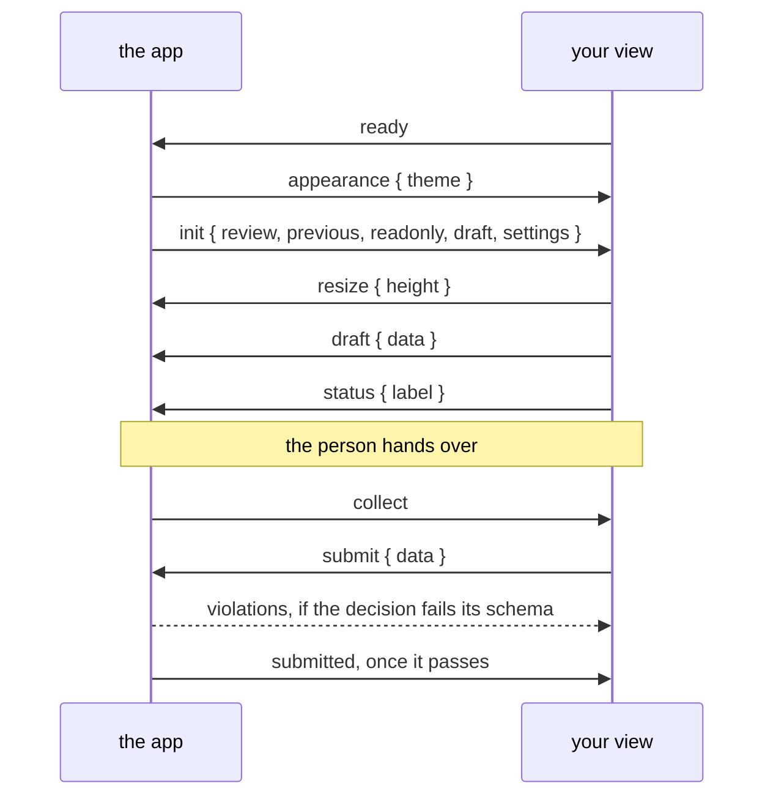

A view and the app talk over `postMessage`. The SDK, `/sdk/v1/pinrail-plugin.js`, speaks this protocol for you, and most plugins never see a raw message. Read this page when you want to know exactly what happens, or to write a view without the SDK.

## Messages

Every message is a JSON object with the protocol version and a type:

```json
{
  "pinrail": 1,
  "type": "draft",
  "data": { "decisions": [] }
}
```

The view announces itself with `ready`, and the app answers with `init`. From then on, either side can send. The app accepts messages only from the view's own frame. The view should accept messages only from the app: it checks that `event.source` is `window.parent`, and after `init`, that `event.origin` equals the `shell_origin` that `init` gives.



## From the app to your view

| Type | Fields | When |
|---|---|---|
| `init` | `review`, `previous`, `readonly`, `draft`, `settings`, `shell_origin`, `capabilities` | In answer to `ready`. It comes again, with `readonly: true`, when the review stops being pending while the view is open, for example when the agent withdraws it. After the view's own hand-over, `submitted` comes instead. |
| `attachment` | `req`, `ok`, and `name`, `media_type`, `size`, `bytes`; or `error` | The answer to the view's `attachment`, with the same `req`. `bytes` is an `ArrayBuffer`, transferred. |
| `collect` | | The person pressed the hand-over button, or <kbd>⌘↵</kbd>. |
| `violations` | `errors: [{ path, message }]` | A submitted decision failed the decision schema, or a `settings_set` failed the plugin's settings schema. Settings errors have paths under `/plugins/<full name>`, such as `/plugins/forgeplane~1list`, so a view can tell them apart. |
| `submitted` | `decision` | The decision was accepted. The app then returns to the inbox and closes the view, so there is no need to show the decision. When the person opens the review again, `init` comes with `readonly: true` and the decision. |
| `appearance` | `theme: "dark" \| "light"` | Before `init`, and whenever the app's theme changes. |
| `settings` | `settings` | The plugin's own settings changed, in the app or from a view. |
| `key` | `key`, `code`, `metaKey`, `ctrlKey`, `altKey`, `shiftKey` | A shortcut the manifest declares, pressed while the app, not the frame, had focus. |

### `init`

`init` carries everything the view needs to render.

| Field | Type | Meaning |
|---|---|---|
| `review` | object | The review: its `id`, `title`, `status`, `origin`, `payload`, and `decision` once there is one. |
| `previous` | object or `null` | The round this review revises, with its decision, so you can show earlier verdicts beside the new ones. |
| `readonly` | boolean | `true` whenever the review is not pending. |
| `draft` | any or `null` | What the view last posted as a draft for this review. |
| `settings` | object | The plugin's own settings: every key the manifest declares, with its current value. |
| `shell_origin` | string | The app's origin. Accept messages from it alone. |
| `capabilities` | string array | What the app can do beyond the messages above: `"attachments"` when it hands a view the files a review carries. |

`review.attachments` lists those files, each with its `name`, `size`, `media_type` and `sha256`.

A review is read-only for one of four reasons, and `review.status` says which:

| `review.status` | Meaning |
|---|---|
| `decided` | A decision was handed over. It is in `review.decision`. |
| `withdrawn` | The agent took the review back before anyone decided. |
| `discarded` | The person said no and told the agent to stop. `review.discarded_by` and `review.discarded_reason` say who and why. |
| `expired` | The review passed its expiry without a decision. |

Render all four the same way: what was there, and nothing to submit.

### `collect`

`collect` means the person asked to hand over. Assemble the decision and send `submit`. The view does not have to submit at once. It can show what would be sent or display a warning, update the button's label with `status`, and submit on the next `collect`.

:::note
A view never draws its own submit button. The app puts one below every review, in the same place for every plugin, so nothing leaves on a single click and the person always knows where to look.
:::

### `violations`

The app validates every decision against the plugin's decision schema before the agent sees it. When one fails, the errors come back with a [JSON Pointer](https://datatracker.ietf.org/doc/html/rfc6901) into the rejected decision:

```json
{
  "pinrail": 1,
  "type": "violations",
  "errors": [
    {
      "path": "/decisions/0/action",
      "message": "\"later\" is not one of [\"close\",\"keep\"]"
    }
  ]
}
```

Show them next to the fields they name, and let the person hand over again.

### `key`

A shortcut you declare in the manifest reaches your view even when the person pressed it with the app in focus. The SDK dispatches it as a `keydown` on your document, marked `pinrailForwarded: true`, so the listener you already have handles both. See [Settings and keys](/docs/building/settings-and-keys/#keyboard-shortcuts).

## From your view to the app

| Type | Fields | Effect |
|---|---|---|
| `ready` | | The view is listening. The app answers with `init`. |
| `resize` | `height`: a number, or `"fill"` | Sizes the frame. A number is the content height in pixels and the page scrolls; `"fill"` gives the view the viewport's height and the view scrolls inside. |
| `draft` | `data` | Keeps work in progress. It comes back in `init` as `draft`, for as long as the app keeps running. |
| `status` | `label` | What the app's hand-over button should read, such as `Hand over 3 of 5`. |
| `submit` | `data` | The decision. Validated against the decision schema. |
| `settings_set` | `patch` | Writes the plugin's own settings. Everyone hears the result as `settings`. |
| `key` | `key`, `code`, `metaKey`, `ctrlKey`, `altKey`, `shiftKey` | One of the app's own keys on the review screen, <kbd>?</kbd>, <kbd>[</kbd> or <kbd>]</kbd>, pressed in the view outside a text field and left alone by it. The SDK sends it; the app acts on it as if pressed in its window. |
| `open` | `url` | Asks the app to open a link in the person's browser. Only `http`, `https` and `mailto` addresses are considered. The app asks the person first, unless they allowed the address's origin for this plugin. It always asks about a `mailto` address and an address longer than 2,000 characters, and it ignores `open` messages that arrive while it is asking. |
| `attachment` | `req`, `name`, and `round: "previous"` for a file of the round this one revises | Asks for the bytes of a file the review carries. The app answers with `attachment` and the same `req`. |

### `resize`

`resize` with `"fill"` suits a workbench, such as a diff with its own scrolling panes. The code review plugin works this way.

### `attachment`

A view's frame can fetch nothing, so a file the review carries arrives this way. Number each request:

```json title="the view asks"
{
  "pinrail": 1,
  "type": "attachment",
  "req": 7,
  "name": "pivot.glb"
}
```

The answer carries the same number, and the bytes as an `ArrayBuffer`:

```json title="the app answers"
{
  "pinrail": 1,
  "type": "attachment",
  "req": 7,
  "ok": true,
  "name": "pivot.glb",
  "media_type": "model/gltf-binary",
  "size": 1843302,
  "bytes": "<ArrayBuffer>"
}
```

The app answers only for names in `review.attachments` (or in `previous.attachments`, with `round: "previous"`), and says why otherwise, with `ok: false` and `error`. Ask again for another copy: each answer transfers its buffer. An app without `"attachments"` in `capabilities` does not answer; the SDK's `plugin.attachment` rejects at once there, saying the app needs updating.

## The first frame

A message cannot reach your view before it paints, so the theme travels on the frame's URL too: it ends in `#pinrail-theme=dark` or `#pinrail-theme=light`. The SDK reads it as it loads and sets `data-theme` on your root element, so the first frame is already in the app's theme.

```css
:root { --bg: #18191b; --text: #ededef; color-scheme: dark; }
[data-theme="light"] { --bg: #ffffff; --text: #24262c; color-scheme: light; }
```

:::caution[Load the SDK with a plain script tag]
`<script src="/sdk/v1/pinrail-plugin.js">` runs before the first paint. A `defer` or `type="module"` script runs after it, which is too late to choose a colour.
:::

## Without the SDK

The SDK is a convenience, not a requirement. A view that speaks the protocol itself needs about this much:

```js title="view/index.html (script)"
let shell = null;

addEventListener("message", (event) => {
  const msg = event.data;
  if (event.source !== parent) return;              // only the app's window
  if (!msg || msg.pinrail !== 1) return;
  if (msg.type === "init") shell = msg.shell_origin;
  if (event.origin !== shell) return;              // and only the app's origin

  switch (msg.type) {
    case "init": render(msg.review, msg.readonly, msg.draft); break;
    case "collect": post({ type: "submit", data: decision() }); break;
    case "violations": showErrors(msg.errors); break;
    case "submitted": showDecided(msg.decision); break;
  }
});

const post = (msg) => parent.postMessage({ pinrail: 1, ...msg }, shell ?? "*");
post({ type: "ready" });
```

Without the SDK, your view must also do the following: size the frame on every change, debounce drafts, apply the theme before the first paint, forward links with `open`, and handle <kbd>⌘↵</kbd>.

## Versions

`v1` in `/sdk/v1/` is the protocol's major version. The app serves the SDK itself, so every review, including one decided months ago, loads the SDK of the installed app. Within `v1`, the SDK changes only in ways that keep existing views working.
