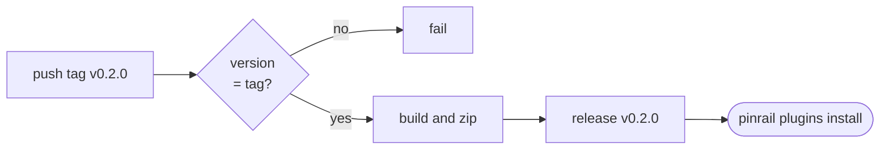

The best way to share a plugin is a GitHub release with the built bundle attached. People install it with one command, Pinrail downloads the bundle and serves it as it is, and nothing is built or run on their machine.

```sh
pinrail plugins install https://github.com/acme/ticket-triage/releases
```

## What a release needs

- **One `.zip` that is the bundle.** It holds `manifest.json`, the schemas and the view, either at the root of the archive or inside a single folder, the way most zip tools lay it out. If you attach several zips, name the bundle `pinrail-plugin.zip`.
- **A tag that matches the manifest's version**, with or without a leading `v`. A release tagged `v1.2.0` whose manifest says `1.1.0` is refused.
- **Only what the app serves.** Leave out sources, tests, fixtures, `node_modules` and tool configuration. Anything else in the zip is served with the view.

## Publish with GitHub Actions

`pinrail-plugin create` writes `.github/workflows/release.yml` into every new plugin. Push a tag and it publishes the release:

```sh
git tag v0.2.0
git push origin v0.2.0
```



The workflow checks the version, runs the manifest's `build` command when there is one, zips the bundle as `<name>-<version>.zip`, and attaches it to a release of the same tag:

```yaml title=".github/workflows/release.yml"
name: release

on:
  push:
    tags: ["v*"]

jobs:
  bundle:
    runs-on: ubuntu-latest
    permissions:
      contents: write
    steps:
      - uses: actions/checkout@v4
      - uses: actions/setup-node@v4
        with:
          node-version: 22
      - name: Name and version
        id: plugin
        run: |
          echo "name=$(node -e 'process.stdout.write(require("./manifest.json").name)')" >> "$GITHUB_OUTPUT"
          echo "version=${GITHUB_REF_NAME#v}" >> "$GITHUB_OUTPUT"
          declared=$(node -e 'const v=require("./manifest.json").version; process.stdout.write(typeof v==="number" ? v+".0.0" : v)')
          test "$declared" = "${GITHUB_REF_NAME#v}" || { echo "manifest says $declared, tag says ${GITHUB_REF_NAME#v}"; exit 1; }
      - name: Build when the manifest declares a build
        run: |
          command=$(node -e 'const m=require("./manifest.json"); process.stdout.write(m.build?.command ?? "")')
          if [ -n "$command" ]; then sh -c "$command"; fi
      - name: The bundle, and nothing else
        run: |
          zip -r "${{ steps.plugin.outputs.name }}-${{ steps.plugin.outputs.version }}.zip" . \
            -x "node_modules/*" "src/*" "tests/*" "test/*" "fixtures/*" ".*" "*/.*" "*.zip" \
               "package.json" "package-lock.json" "pnpm-lock.yaml" "yarn.lock" "bun.lockb" \
               "tsconfig*.json" "vite.config.*" "vitest.config.*" "playwright.config.*"
      - uses: softprops/action-gh-release@v2
        with:
          files: ${{ steps.plugin.outputs.name }}-${{ steps.plugin.outputs.version }}.zip
```

:::tip[Bump the version first]
Raise `version` in `manifest.json`, commit, then tag. The workflow fails fast when the two disagree, before anything is published.
:::

## Without GitHub Actions

The recipe is three steps, in any CI or by hand:

1. **Build**, if the manifest declares a `build` command.
2. **Zip** the folder without its sources, tests, fixtures, `node_modules` and dot-files.
3. **Attach** the zip to a GitHub release whose tag is the manifest's version.

## Choosing the version

The major version is a promise to every review already created with your plugin: Pinrail keeps one copy per major, and a review keeps rendering with the latest copy of the major it was created under.

| You changed | Release as |
|---|---|
| A fix in the view, or a new optional field | A minor or patch: `1.2.0` → `1.3.0`. Existing reviews pick it up. |
| A schema, or the view, in a way an old review would not survive | A new major: `1.3.0` → `2.0.0`. Old reviews keep `1.x`. |

A plugin that is still finding its shape starts at `0.1.0`.

## How people install and update it

| They install from | They get |
|---|---|
| `https://github.com/<owner>/<repo>/releases` | The latest release. *Check for updates* compares its tag with what is installed. |
| `https://github.com/<owner>/<repo>/releases/tag/v1.2.0` | That release, pinned. Update checks leave it where it is. |

Publish the install command in your README, next to a screenshot of the view. That is usually all someone needs to decide whether to try it.
