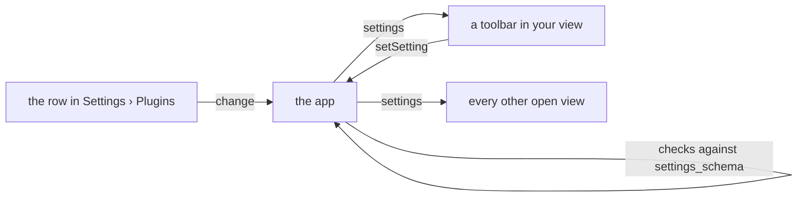

Two optional parts of the manifest make a plugin feel like part of the app: **settings**, which the app draws as rows under your plugin in *Settings › Plugins*, and **shortcuts**, which the app lists in its keyboard help and hands to your view.

## Settings

A plugin with options, such as a diff shown inline or side by side, declares them as a JSON Schema in `settings_schema`:

```json title="manifest.json"
{
  "settings_schema": {
    "type": "object",
    "properties": {
      "diff": {
        "type": "string",
        "title": "Diff",
        "description": "How a file's changes are laid out",
        "oneOf": [
          { "const": "inline", "title": "Inline" },
          { "const": "split", "title": "Side by side" }
        ],
        "default": "inline"
      },
      "wrap": { "type": "boolean", "title": "Wrap long lines", "default": true },
      "context": { "type": "integer", "title": "Context lines", "minimum": 0, "maximum": 20, "default": 3 }
    }
  }
}
```

Each property becomes one row, in the order you declare them:

| In the schema | In *Settings › Plugins* |
|---|---|
| `title` | The row's label. |
| `description` | The line under the label. |
| `"type": "boolean"` | A switch. |
| a string with `enum`, or `oneOf` of `const` values with titles | A choice. `oneOf` lets each value have a readable title. |
| `"type": "integer"` or `"number"` with `minimum` and `maximum` | A number kept within those bounds. |
| `default` | The value until the person changes it. Required on every property. |

The schema is one level deep: every property is a `boolean`, `string`, `integer` or `number`, and every property has a `default`. Like the payload and decision schemas, it can be inline or a `$ref` to a file in the plugin folder.

:::note[An invalid settings schema]
If `settings_schema` breaks these rules, the app ignores it and still loads the plugin, without settings, and its row in *Settings › Plugins* shows the reason. `pinrail plugins check <folder>` reports the same before you install.
:::

### Reading settings in the view

The values arrive in `init` and again whenever they change, whether the person changed them in *Settings* or another view did. Every key the schema declares is present, with its default under whatever the person set.

```js
const plugin = Pinrail.connect({
  onInit() { render(); },
  onSettings(settings) { render(); },   // never re-initialises the view or touches its draft
});

const layout = () => plugin.settings.diff;   // "inline" or "split"
```

### Writing settings from the view

A control in your view can change a setting directly. The app checks the value against your schema, keeps it, and sends the new values to every open view of the plugin, so a toggle in your view and the row in *Settings* change the same setting.

```js
splitButton.onclick = () => plugin.setSetting("diff", "split");
```



A view can only write its own plugin's settings. `setSetting` returns a promise: it resolves with the settings once the app keeps the value, and it rejects when the schema refuses it, with the reasons in the error's `violations`.

### Where the values live

Settings are stored in the app's `settings.json` under `plugins.<name>`. A script can change one through the local API, and the app validates it the same way:

```sh
curl -X PATCH http://127.0.0.1:4747/api/v1/settings \
  -H 'content-type: application/json' \
  -d '{"plugins": {"review": {"diff": "split"}}}'
```

## Keyboard shortcuts

A view that answers keys declares them in `shortcuts`:

```json title="manifest.json"
{
  "shortcuts": [
    { "keys": "j", "does": "Next proposal" },
    { "keys": "k", "does": "Previous proposal" },
    { "keys": "a", "does": "Accept the focused proposal", "group": "Verdicts" },
    { "keys": "x", "does": "Reject the focused proposal", "group": "Verdicts" },
    { "keys": "cmd+shift+f", "does": "Fold every file" }
  ]
}
```

Declaring a key does two things for you:

1. **It is listed.** The app's keyboard help, opened with <kbd>?</kbd>, shows your keys under your plugin whenever one of its reviews is open. Your view needs no help overlay of its own.
2. **It is forwarded.** When the person presses the key with the app in focus rather than your frame, after clicking the top bar or arriving from the inbox, the app hands it to your view.

| Field | Meaning |
|---|---|
| `keys` | Modifiers joined by `+`, in any order, then one key. The modifiers are `cmd`, `ctrl`, `alt` and `shift`; `command`, `control` and `option` also work, and `cmdorctrl` means <kbd>⌘</kbd> on macOS and <kbd>Ctrl</kbd> on Linux. Name the physical key. Write a letter or digit as itself (`j`, `1`), a punctuation key as the character it types without <kbd>Shift</kbd> (`/`, `[`, `,`), and any other key as its `KeyboardEvent.code` in lowercase (`enter`, `escape`, `arrowdown`). Write a shifted character with `shift`: <kbd>?</kbd> is `shift+/`. |
| `does` | The one-line label shown in the keyboard help. |
| `group` | Optional. Lists the entry under this caption. |

### Handling a forwarded key

A forwarded key arrives as a `keydown` on your document, exactly like a press inside the frame, so the listener you already have handles both:

```js
document.addEventListener("keydown", (e) => {
  if (e.key === "j") focusNext();
  if (e.key === "a") accept(focused);
  // e.pinrailForwarded is true when the app handed the key over
});
```

Only declared keys are forwarded. A view that declares none receives none.

:::caution[Keys the app keeps]
Some keys belong to the app and are never forwarded:

- on the review screen: <kbd>?</kbd>, <kbd>[</kbd>, <kbd>]</kbd>, <kbd>esc</kbd> and <kbd>⌘↵</kbd>;
- in the app's menus: <kbd>⌘K</kbd>, <kbd>⌘,</kbd>, <kbd>⌘I</kbd>, <kbd>⌘B</kbd>, <kbd>⌘[</kbd>, <kbd>⌘]</kbd>, <kbd>⌘⇧H</kbd>, <kbd>⌘⇧P</kbd>, <kbd>⌘⇧M</kbd>, <kbd>⌘⇧L</kbd>, <kbd>⌘W</kbd>, <kbd>⌘M</kbd> and <kbd>⌘Q</kbd>;
- the standard editing keys: <kbd>⌘Z</kbd>, <kbd>⌘⇧Z</kbd>, <kbd>⌘X</kbd>, <kbd>⌘C</kbd>, <kbd>⌘V</kbd> and <kbd>⌘A</kbd>;
- on macOS only: <kbd>⌘H</kbd>, <kbd>⌥⌘H</kbd> and <kbd>⌃⌘F</kbd>.

On Linux, read <kbd>Ctrl</kbd> for <kbd>⌘</kbd>. Every other combination you declare, including other <kbd>⌘</kbd> combinations, is forwarded. If you declare one of the app's keys, the keyboard help marks it as taken by the app.

They work while your view has the keyboard too: pressed outside a text field, <kbd>?</kbd>, <kbd>[</kbd> and <kbd>]</kbd> go up to the app, unless your view handled them first and called `preventDefault()`.
:::
