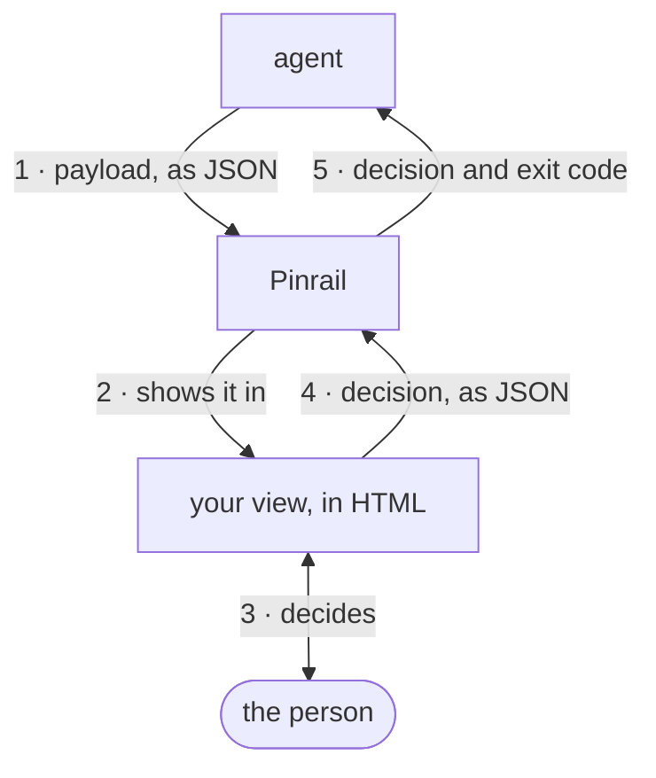
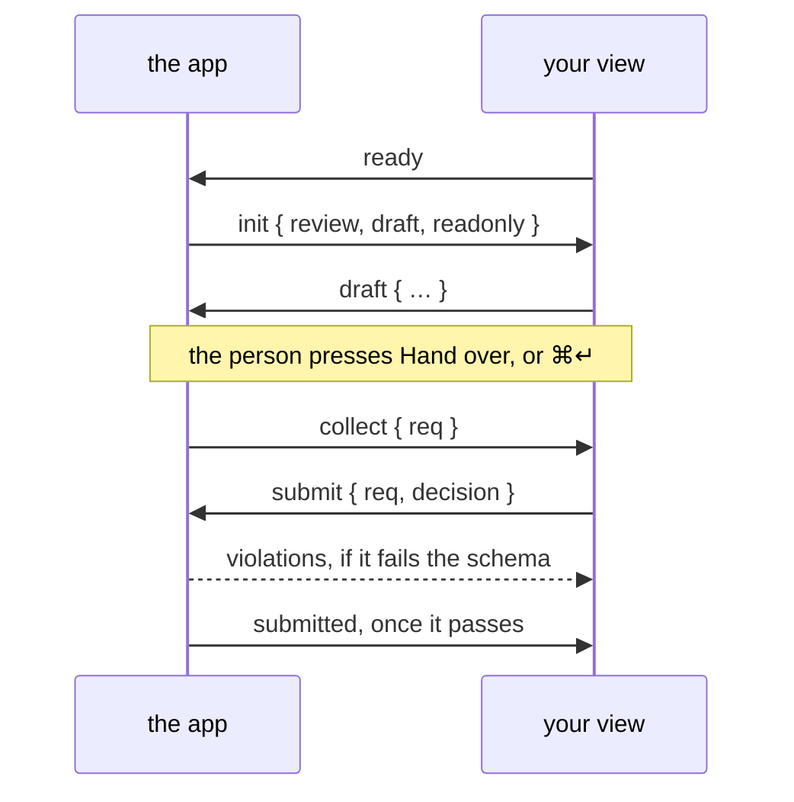

A plugin teaches Pinrail one kind of review. It says what an agent sends, what comes back, and what the person sees in between. The app provides everything else: the inbox, notifications, the history, and the command the agent waits on.

A plugin is a folder with three things in it:

- a **manifest**, `manifest.json`, which names the plugin and points at the rest;
- two **JSON Schemas**: the payload the agent sends, and the decision that goes back;
- a **view**, an HTML page the app shows in a sandboxed frame.

The agent and the app exchange JSON, and the person sees your HTML view. The agent never sees your HTML, and your view never talks to the agent. The app sits between them and checks both sides against your schemas.



## Create the folder

The `pinrail` command that comes with the app writes a plugin that runs, with nothing else to install:

```sh
pinrail plugins new ticket_triage --link
```

The name is lowercase letters, digits, `_` and `-`, starting with a letter, and it must be unique among your installed plugins. `--link` installs the folder straight away, so the app serves it live.

```text title="ticket_triage/"
ticket_triage/
├── manifest.json            what the app reads first
├── schemas/
│   ├── payload.schema.json  what the agent sends
│   └── decision.schema.json what comes back
├── view/
│   ├── index.html           what the person sees
│   ├── view.js              its script, checked against the SDK's types
│   └── icons/               the icons the view draws, check.svg and x.svg, with their LICENSE
├── icon.svg                 the plugin's icon, in the app
├── samples/
│   └── ticket_triage.json   a review to look at
├── pinrail-plugin.d.ts      the SDK's types, for your editor
├── README.md                what the plugin is, and how to try it
├── AGENTS.md                directs a coding agent to the building guide
└── CLAUDE.md                points Claude Code to AGENTS.md
```

`AGENTS.md`, with a `CLAUDE.md` that points to it, directs a coding agent to `pinrail docs plugins/building`. That guide explains each file, how the view talks to the app, and how to try the plugin, so you can hand the folder to your agent and describe the plugin you want.

:::note[With a framework, or tests]
To build the view with React, Vue or Svelte, or to test it in a browser without the app, use the plugin SDK from a checkout of the Pinrail repository. See [Building with a framework](/docs/building/frameworks/).
:::

Each of the files the app reads has a fixed place in the folder, so the manifest does not name them:

| Path | Contents |
|---|---|
| `manifest.json` | Required. The plugin's name, version and declarations. |
| `schemas/payload.schema.json` | Required. What an agent sends. |
| `schemas/decision.schema.json` | Required. What the view hands back. |
| `view/index.html` | Required. The view's page, with its scripts, styles, fonts and images beside it in `view/`. |
| `templates/decision.md.j2` | Optional. A template that renders a decision as markdown. |
| `icon.svg` | Optional. The plugin's icon, shown wherever the app names the plugin, in the text's colour. A [Lucide](https://lucide.dev/icons) icon fits the app best. |
| `samples/` | Optional. Reviews to try the plugin with, one `<name>.json` file each, and the files they attach. |
| `README.md`, `LICENSE` | Optional. What the plugin is, and the terms it is shared under. |

When the plugin is installed, Pinrail copies these entries and nothing else. Sources, tests, fixtures, `node_modules/`, package and tool configuration, hidden files, `AGENTS.md` and `pinrail-plugin.d.ts` stay in your folder.

## The manifest

```json title="manifest.json"
{
  "name": "ticket_triage",
  "version": "0.1.0",
  "title": "Ticket triage",
  "description": "Support tickets sorted into keep, merge or close.",
  "use_when": "You triaged a queue of support tickets and need a person to confirm each call before you act on it."
}
```

| Key | What it does |
|---|---|
| `name` | The plugin's identifier. Agents submit to it: `pinrail submit ticket_triage`. |
| `version` | Semantic, such as `"1.2.0"`. See [Versions](#versions). |
| `title` | What the app calls the plugin in its lists and settings. |
| `description` | A sentence on what the plugin is for. |
| `use_when` | The situation an agent should ask with this plugin in. Agents read it in `pinrail plugins` when they choose a plugin. |

Write `use_when` for an agent deciding between plugins: name the moment, not the feature. *You triaged a queue of support tickets and need a person to confirm each call* tells an agent when to reach for the plugin; *Ticket triage view* does not.

The manifest can also declare [settings and keyboard shortcuts](/docs/building/settings-and-keys/), a template that [renders decisions as markdown](#decisions-as-markdown), a `build` command for a view that compiles (see [Building with a framework](/docs/building/frameworks/)), and the [files](#files-beside-the-payload) the plugin takes.

:::tip[Check before you install]
`pinrail plugins check ./ticket_triage` reads the folder the way the app will and reports what it would refuse, installing nothing.
:::

## The two schemas

The schemas are the contract. The app validates every payload before it reaches the inbox and every decision before it reaches the agent, so both sides can rely on the shape.

```json title="schemas/payload.schema.json"
{
  "$schema": "https://json-schema.org/draft/2020-12/schema",
  "type": "object",
  "required": ["tickets"],
  "properties": {
    "tickets": {
      "type": "array",
      "items": {
        "type": "object",
        "required": ["id", "title"],
        "properties": {
          "id": { "type": "integer" },
          "title": { "type": "string" },
          "body": { "type": "string" }
        }
      }
    }
  }
}
```

```json title="schemas/decision.schema.json"
{
  "$schema": "https://json-schema.org/draft/2020-12/schema",
  "type": "object",
  "required": ["decisions"],
  "additionalProperties": false,
  "properties": {
    "decisions": {
      "type": "array",
      "items": {
        "type": "object",
        "required": ["id", "action"],
        "properties": {
          "id": { "type": "integer" },
          "action": { "enum": ["close", "keep"] },
          "note": { "type": "string" }
        }
      }
    }
  }
}
```

Design the decision for whoever reads it next. An agent reads it as markdown and a script reads it as JSON, so name fields for what they mean (`action`, `note`) rather than for how the view collects them.

:::note
A payload that fails its schema never reaches the inbox: the agent's `pinrail submit` exits with code 2 and prints the errors. A decision that fails is sent back to your view as `violations`, and the person can fix it before anything leaves.
:::

## The view

The view is one HTML page. It loads the SDK from the app, answers the handshake, renders the payload, and hands a decision back. This example keeps its script in the page to show it whole; the scaffold puts it in `view/view.js`, where `// @ts-check` and `pinrail-plugin.d.ts` let your editor check every call.

```html title="view/index.html" {3,5,9-17}
<!doctype html>
<html lang="en">
<link rel="stylesheet" href="/sdk/v1/pinrail-plugin.css">
<body>
<script src="/sdk/v1/pinrail-plugin.js"></script>
<script>
  const view = Pinrail.layout({ title: "Tickets" });
  const choices = new Map();
  const plugin = Pinrail.connect({
    onInit({ review, draft }) {
      for (const d of review.decision?.data.decisions ?? draft?.decisions ?? []) choices.set(d.id, d.action);
      render();
    },
    onCollect() {
      return { decisions: [...choices].map(([id, action]) => ({ id, action })) };
    },
  });

  function render() {
    view.content.innerHTML = plugin.review.payload.tickets.map((t) => `
      <div class="pinrail-item">
        <div class="pinrail-item-head"><span class="pinrail-item-id">#${t.id}</span><span class="pinrail-item-title">${Pinrail.escape(t.title)}</span></div>
        <div class="pinrail-item-controls">
          <button class="pinrail-btn" data-id="${t.id}" data-action="close" aria-pressed="${choices.get(t.id) === "close"}">Close</button>
          <button class="pinrail-btn" data-id="${t.id}" data-action="keep" aria-pressed="${choices.get(t.id) === "keep"}">Keep</button>
        </div>
      </div>`).join("");
  }

  view.content.addEventListener("click", (e) => {
    const b = e.target.closest("button[data-id]");
    if (!b || plugin.readonly) return;
    choices.set(Number(b.dataset.id), b.dataset.action);
    plugin.draft({ decisions: [...choices].map(([id, action]) => ({ id, action })) });
    render();
  });
</script>
```

`Pinrail.connect` does the protocol for you: it announces the view, receives the review, sizes the frame to your content and keeps drafts. You write two callbacks and a renderer.

- **`onInit`** runs with the review (`review`, payload included), whether it is `readonly`, the `previous` round when this one revises another, and the `draft` the person left. It runs again, read-only, when the review ends while it is open, for example when the agent withdraws it, so it should draw the view from scratch each time rather than add to what is there.
- **`onCollect`** runs when the person hands over. Return the decision, or a promise of it. Return nothing when the person still has to do something first, and say what in the view; the next press asks again.
- **`plugin.draft`** keeps work in progress, so the person can open another review, or reload the view, and find their work in place.

:::caution[Drafts last only while the app runs]
The app keeps drafts only while it is running. They do not survive quitting, restarting or updating Pinrail, so a view must not rely on a draft to hold anything the person cannot enter again.
:::



The full list of messages is in [The protocol](/docs/building/protocol/).

### The hand-over belongs to the app

Your view does not draw a submit button. The app puts one below every review, in the same place for every plugin, and sends `collect` when the person presses it or presses <kbd>⌘↵</kbd>. Because the button always belongs to the app, no plugin can send a decision on a single click. The person makes their choices first, and then hands them over.

Tell the button what it will do with `plugin.handOverLabel`:

```js
plugin.handOverLabel(`Hand over ${choices.size} of ${plugin.review.payload.tickets.length}`);
```

### When the review is read-only

After a decision, and when the agent withdraws the review, the view opens read-only: `plugin.readonly` is `true` and `plugin.review.decision` holds what was decided. Render what was there, without controls. A decided review stays open to anyone reading the history, months later.

## The sandbox

The view runs in a frame with an opaque origin and a strict Content Security Policy.

:::caution[No network]
A view cannot fetch, load a web font, or use a CDN. Scripts, styles, images and fonts must be inline or files inside the plugin folder, and everything the view shows must arrive in the payload, or as a [file beside it](#files-beside-the-payload). Design the payload with that in mind: send the diff, not a link to it.
:::

Links still work for the person. A click on an `http`, `https` or `mailto` link asks the app to open it in their browser, and `plugin.open(url)` does the same from code. The app shows the person where the link goes and opens it when they agree. They can allow a site for your plugin, so that its links open without asking from then on.

## Files beside the payload

Some things a person reviews are files: a 3D model, a PDF, a recording, a set of photos. A plugin can take them beside the payload, so the agent sends each file as it is rather than inlining it.

Declare the kinds the plugin takes in the manifest:

```json title="manifest.json"
"attachments": {
  "accept": [".glb", "model/gltf-binary", "image/*"],
  "max_size": 52428800,
  "max_count": 12
}
```

`accept` lists extensions and media types; a file matches by either. `max_size` (bytes) and `max_count` are optional and can be at most the app's own limits of 100 MB a file and 32 files a review. A review's files may add up to 512 MB in all, whatever the plugin says. A plugin without `attachments` takes no files.

The payload names each file by an object with one key, `$attachment`:

```json
{
  "models": [
    {
      "id": "L1",
      "name": "Pivot",
      "file": { "$attachment": "pivot.glb" }
    }
  ]
}
```

Describe that field in your payload schema with this object in `$defs`. The SDK package has it as `schemas/attachment.schema.json`:

```json title="schemas/payload.schema.json"
"$defs": {
  "attachment": {
    "type": "object",
    "additionalProperties": false,
    "required": ["$attachment"],
    "properties": {
      "$attachment": { "type": "string", "minLength": 1, "maxLength": 120 }
    }
  }
}
```

The app refuses a submission whose payload names a file it did not receive, or a file of a kind your plugin does not take, so a view never meets a missing file.

The view still cannot fetch. It asks the app for the bytes:

```js
const name = Pinrail.attachmentName(model.file);      // "pivot.glb"
const bytes = await plugin.attachment(name);          // an ArrayBuffer
const url = await plugin.attachmentUrl("desk.jpg");   // a blob: URL for an , <video> or <audio>
```

`plugin.attachments` lists what the review carries: each file's `name`, `size`, `media_type` and `sha256`. `plugin.attachment(name, { round: "previous" })` reads a file of the round this one revises, to compare. Revoke a `blob:` URL with `URL.revokeObjectURL` when you are done with it.

The person sees every file a review carries, whatever the plugin draws: the inbox marks the review, and the review shows the files by name and size, each one ready to save.

## A sample to look at

A sample is a whole review, with a title, a realistic payload and the files it refers to. Someone who has just installed your plugin sends it from its details in *Settings › Plugins*, or with `pinrail submit ticket_triage --sample`, and sees what your view does before any agent uses it.

Each sample is a file in `samples/`, named after the sample:

```json title="samples/ticket_triage.json"
{
  "title": "Support queue — 4 stale tickets",
  "payload": { "tickets": [ … ] },
  "attachments": { "screenshot.png": "screenshot.png" }
}
```

It has the shape `pinrail submit --request` reads: `title` and `payload` are required, and `attachments` maps each name the payload refers to onto a file in `samples/`, relative to it. A good fixture usually makes a good sample.

A plugin can have several samples. `pinrail submit ticket_triage --sample stale_queue` sends `samples/stale_queue.json`, and `--sample` alone sends the first in order of name. *Settings › Plugins* offers a button for each.

The first sample's payload is also the plugin's example: `pinrail plugins describe` shows it to an agent as a starting point, and agents read it whole every time they describe the plugin. Keep that sample to the fewest items that show the shape, and put fuller reviews in the samples after it.

If a sample cannot be loaded, the plugin works without it, and its row in *Settings › Plugins* shows the reason. `pinrail plugins check` notes a plugin that has no samples.

## Look like the app

Link `/sdk/v1/pinrail-plugin.css` and your view gets the app's colours in both themes, its type, and classes for the usual shapes: a header, items, buttons, fields, notices. `Pinrail.icon(name)` draws one of the plugin's own icons, and `Pinrail.layout()` the header-and-body skeleton. It is all optional, and your own fonts, styles and scripts can ship in the plugin folder: see [Design and styling](/docs/building/design/).

## Run it

A linked plugin follows its folder: send it its sample, and change the view as you look at it. When you change the folder, the review screen offers *Reload*, which opens the review with the folder as it is now. A change to the manifest, a schema or the template applies to the next submission, and to the review when you reload it. A manifest that breaks shows its error on the plugin's row in *Settings › Plugins* until you fix it.

```sh
pinrail submit ticket_triage --sample   # the review opens in the app
pinrail plugins check ticket_triage     # what the app would refuse, and why
```

### See it in a browser

Every review has a preview at `<server>/preview/reviews/<id>`, by default `http://127.0.0.1:4747/preview/reviews/r_…`. `pinrail open <id> --browser` opens it and prints the address.

The preview shows the review as the app does: your view, given the review, with the hand-over button. It is meant for plugin development, especially for an agent with a browser tool, which can see the view it built and try the hand-over. In the preview, the hand-over checks the decision against the decision schema but does not decide the review. A valid decision is shown as the agent would receive it, and an invalid one is returned to the view. Only the person can decide a review, in the app.

`pinrail docs plugins/building` gives the same to an agent, briefly, from the Pinrail you have installed.

To see it with a payload of your own, send a fixture. `pinrail plugins new` does not create a `fixtures/` folder, so first create `fixtures/basic.json` with the content shown under [Test it](#test-it). Then run:

```sh
pinrail submit ticket_triage --request fixtures/basic.json --wait
```

## Test it

A fixture is a partial review: a `title`, a `payload`, and optionally a `decision` for the read-only case.

```json title="fixtures/basic.json"
{
  "title": "Three stale tickets",
  "payload": {
    "tickets": [
      { "id": 101, "title": "Export times out past 50k rows" },
      { "id": 102, "title": "Typo on the pricing page" },
      { "id": 103, "title": "Mute the flaky resize test" }
    ]
  }
}
```

A fixture can carry files too, by path relative to the fixture: `"attachments": { "pivot.glb": { "path": "pivot.glb" } }`.

A fixture is also a request that the app accepts as it is, files included, so you can send the same review to the app to see it there:

```sh
pinrail submit ticket_triage --request fixtures/basic.json
```

To test the view on its own, in a browser without the app, use the test harness of the plugin SDK. The tests mount the view, use it the way a person would, and read back exactly what it submits. See the [SDK's README](https://github.com/forgeplane/pinrail/tree/main/pinrail-plugin#readme).

## Versions

A review records the release of your plugin that it renders and validates with. When a person opens a pending review, it moves to the release installed now, as long as that release accepts its payload and files. An ended review keeps its release, so a decided review shows what the person saw. A move can change the decision schema, so an agent that receives a decision it does not expect describes the plugin again.

Agents rely on the version, though: an agent that wrote its payloads for `1.3.0` expects `1.4.0` to take them. Follow semantic versioning:

- Fix the view or add an optional field: raise the minor or the patch.
- Change a schema in a way an earlier payload or decision would not pass: raise the major, `2.0.0` after `1.4.2`. Before `1.0.0`, raise the minor, `0.4.0` after `0.3.1`.

`pinrail plugins check ./ticket_triage --since ./previous-release` compares your release's schemas with the previous one's, and lists what the new ones no longer accept. It exits with `2` when the release breaks what the previous one took without announcing it in its version:

| Change to a schema | Without a new major version |
|---|---|
| A new optional property | Allowed |
| A new `enum` value | Allowed |
| A new `title`, `description`, `examples` or `default` | Allowed |
| A removed property | Breaks |
| A newly required property, new or existing | Breaks |
| Any change of `type`, even to a wider one | Breaks |
| A removed `enum` value | Breaks |
| Any other change to what the schema accepts, such as `pattern`, `maxLength` or `additionalProperties` | Breaks |

## Decisions as markdown

The `pinrail` command prints a decision as markdown for the agent. Without a template, the app renders the decision from its structure: each bullet starts with the item's `id` and `action`, a `note` becomes a quotation, and no field is omitted. When a decision reads well only beside its payload, such as "**closed** #101 Export times out past 50k rows" rather than "close: 101", ship a template:

```jinja title="templates/decision.md.j2"

- **{{ "closed" if item.action == "close" else "kept" }}** #{{ item.id }} {{ item.payload.title }}
  
  > {{ item.note }}
  

```

The app uses the template when the plugin has one at `templates/decision.md.j2`.

Templates are written in [MiniJinja](https://docs.rs/minijinja). Each object in `items` has a `payload` field that holds the object with the same `id` from the review's payload, wherever the payload nests it. The template also receives `review`, `decision`, `data` and `note`. The app writes the heading itself, so every plugin's output starts the same way.

The `verb` filter turns common actions into past participles: `accept` and `keep` become "accepted", `reject` and `decline` become "rejected", and `send`, `revise`, `discard`, `approve`, `edit` and `skip` become "sent", "revised", "discarded", "approved", "edited" and "skipped". `request_changes` becomes "changes requested". It leaves any other word unchanged, so `{{ item.action | verb }}` suits a plugin whose actions are among these, and a plugin with other actions spells its own words, as the example above does.

## Summing up a review

The app shows a short summary of each review: what it asks on the inbox row, in notifications and in the review's header, and what was decided in the header, in history and in the command's output. The plugin declares the summary in its manifest. A plugin that declares none has no summary, and the app shows the review's status instead.

A summary counts arrays. The `request` side counts arrays in the payload when the review is submitted, and the `outcome` side counts arrays in the decision when it is handed over. The app keeps both with the review, so a later version of the plugin does not change what history shows.

```json title="manifest.json"
{
  "summary": {
    "request": {
      "counts": [
        {
          "items": "/groups/*/items",
          "by": "severity",
          "values": {
            "blocker": { "tone": "danger" },
            "major": { "tone": "warning" },
            "minor": { "tone": "info" }
          }
        }
      ]
    },
    "outcome": {
      "verdict": {
        "at": "/verdict",
        "values": {
          "approve": { "label": "approved", "tone": "success" },
          "revise": { "label": "changes requested", "tone": "warning" }
        }
      },
      "counts": [
        {
          "items": "/decisions",
          "by": "action",
          "values": {
            "close": { "label": "closed", "tone": "success" },
            "keep": { "label": "kept", "tone": "info" }
          },
          "other": false
        },
        { "items": "/undecided", "label": "undecided" }
      ]
    }
  }
}
```

Each entry in `counts` names an array with `items`, a [JSON Pointer](https://www.rfc-editor.org/rfc/rfc6901) in which `*` stands for every element of an array. `/groups/*/items` counts the items of every group.

- **With `by`**, the entry counts the array's elements by the value of that field. Each value listed in `values` becomes a count, in the order listed, with its own `label` (the value itself when omitted) and `tone`. Elements with a value that is not listed are counted as `other`, unless `"other": false` is set. Elements without the field are not counted.
- **Without `by`**, the entry counts the whole array under its `label` and `tone`.
- **`plural`** gives a label its plural form, which the app uses for any count other than one: `{ "items": "/drafts", "label": "draft", "plural": "drafts" }` reads "1 draft" and "3 drafts". Labels such as "accepted" or "major" need no plural.
- **`tone`** is one of `danger`, `warning`, `info`, `success` and `neutral`, the default. The app chooses the colours, so a summary looks the same in both themes.

A count of zero is left out. A summary shows at most six counts, so the entries of one side may add up to at most six, counting `other` where it applies.

`verdict`, on the `outcome` side only, names one field of the decision and the label and tone of each of its values. A field that holds `true` or `false`, such as a yes-or-no answer, is listed under the keys `"true"` and `"false"`; the same applies to the field that `by` names. The app shows the verdict in place of the review's status, for example "approved" instead of "decided". A value that is not listed shows no verdict.

The app checks the declaration when it loads the plugin. A declaration that is not valid costs the plugin its summaries, and *Settings › Plugins* shows the reason on the plugin's row. `pinrail plugins check` reports the same problems.

## Next

- [The protocol](/docs/building/protocol/): every message between the app and a view.
- [Settings and keys](/docs/building/settings-and-keys/): options in *Settings › Plugins*, and keyboard shortcuts the app lists and forwards.
- [Publishing a plugin](/docs/building/publishing/): a release others install without a toolchain.
