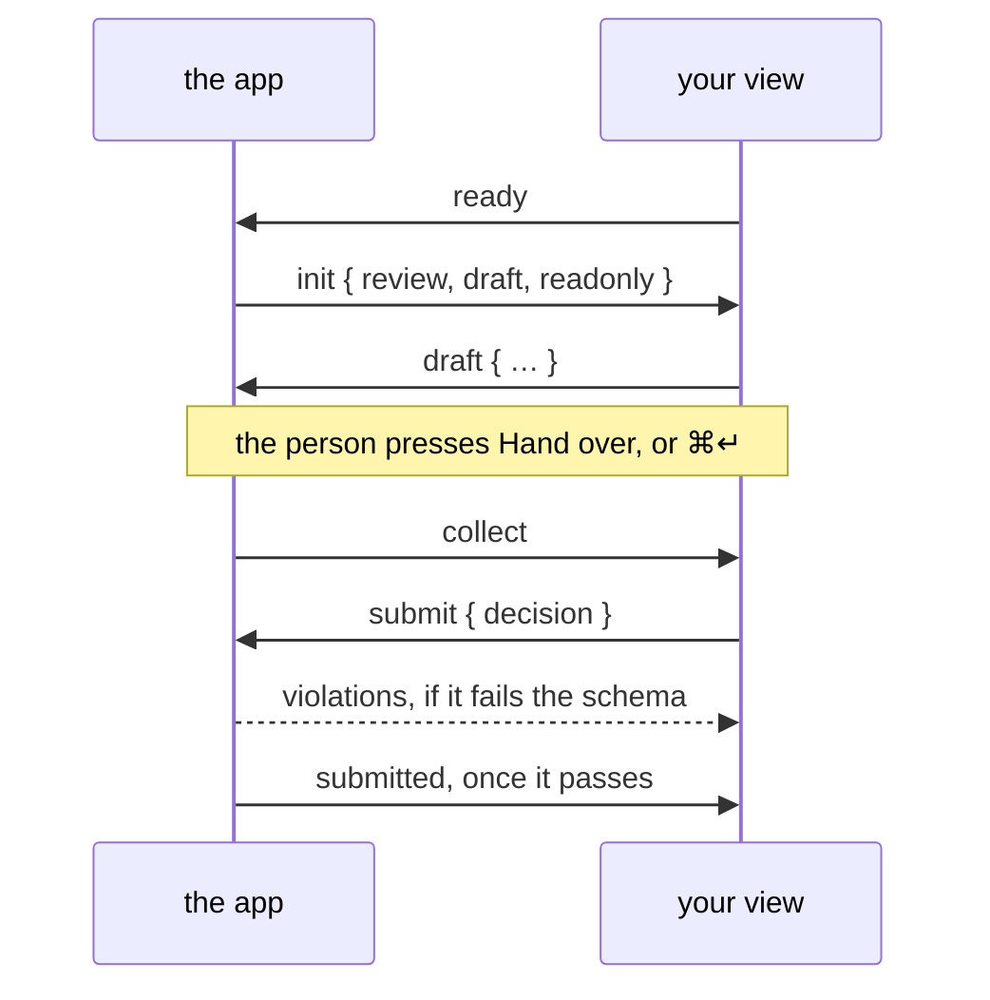

A plugin teaches Pinrail one kind of review. It says what an agent sends, what comes back, and what the person sees in between. Everything else, the inbox, notifications, history and the command the agent waits on, is the app's.

A plugin is a folder with three things in it:

- a **manifest**, `manifest.json`, which names the plugin and points at the rest;
- two **JSON Schemas**: the payload the agent sends, and the decision that goes back;
- a **view**, an HTML page the app shows in a sandboxed frame.

JSON is the transport and HTML is the view. The agent never sees your HTML, and your view never talks to the agent: the app sits between them and checks both sides against your schemas.


## Create the folder

The `pinrail` command that comes with the app writes a plugin that runs, with nothing else to install:

```sh
pinrail plugins new ticket_triage --link
```

The name is lowercase letters, digits, `_` and `-`, starting with a letter, and it must be unique among your installed plugins. `--link` installs the folder straight away, so the app serves it live.

```text title="ticket_triage/"
ticket_triage/
├── manifest.json            what the app reads first
├── schemas/
│   ├── payload.schema.json  what the agent sends
│   └── decision.schema.json what comes back
├── view/
│   ├── index.html           what the person sees
│   ├── view.js              its script, checked against the SDK's types
│   └── icons/               the icons the view draws, check.svg and x.svg
├── icon.svg                 the plugin's icon, in the app
├── example.json             the smallest payload, for agents
├── sample.json              a review to look at
├── pinrail-plugin.d.ts      the SDK's types, for your editor
├── AGENTS.md                the plugin explained to an agent that helps you build it
└── CLAUDE.md                points Claude Code to AGENTS.md
```

`AGENTS.md` (with a `CLAUDE.md` that points to it) tells a coding agent what each file is for, how the view talks to the app, and how to try it, so you can hand the folder to your agent and describe the plugin you want.

:::note[With a framework, or tests]
To build the view with React, Vue or Svelte, or to test it in a browser without the app, use the plugin SDK from a checkout of the Pinrail repository. See [Building with a framework](/docs/building/frameworks/).
:::

When the plugin is installed, Pinrail copies the folder except `src/`, `tests/`, `fixtures/`, `node_modules/`, package and tool configuration such as `package.json` and `vite.config.ts`, and hidden files. Everything else, including `AGENTS.md` and `pinrail-plugin.d.ts`, is copied and served with the view.

## The manifest

```json title="manifest.json"
{
  "name": "ticket_triage",
  "version": "0.1.0",
  "title": "Ticket triage",
  "description": "Support tickets sorted into keep, merge or close.",
  "use_when": "You triaged a queue of support tickets and need a person to confirm each call before you act on it.",
  "icon": "icon.svg",
  "payload_schema": { "$ref": "schemas/payload.schema.json" },
  "decision_schema": { "$ref": "schemas/decision.schema.json" },
  "example": "example.json",
  "sample": "sample.json",
  "entry": "view/index.html",
  "min_height": 200
}
```

| Key | What it does |
|---|---|
| `name` | The plugin's identifier. Agents submit to it: `pinrail submit ticket_triage`. |
| `version` | Semantic, such as `"1.2.0"`. The major version is a compatibility promise; see [Versions](#versions). |
| `title` | What the app calls the plugin in its lists and settings. |
| `description` | A sentence on what the plugin is for. |
| `use_when` | The situation an agent should ask with this plugin in. Agents read it in `pinrail plugins` when they choose a plugin. |
| `icon` | An SVG file in the folder, shown wherever the app names the plugin, in the text's colour. A [Lucide](https://lucide.dev/icons) icon fits the app best. |
| `payload_schema`, `decision_schema` | JSON Schema 2020-12, inline or as a `$ref` to a file inside the folder. |
| `example` | A JSON file inside the folder with a payload that passes `payload_schema`. Agents get it as a starting point, and read it whole every time they describe the plugin, so keep it to the fewest items that show the shape: one of each kind, short texts, files by name rather than inline. |
| `sample` | A review anyone can send to see the plugin: a request file inside the folder with a `title`, a `payload` and any files. See [A sample to look at](#a-sample-to-look-at). |
| `entry` | The view's HTML file, relative to the folder. |
| `min_height` | The smallest height, in pixels, the app gives the view. |

Write `use_when` for an agent deciding between plugins: name the moment, not the feature. *You triaged a queue of support tickets and need a person to confirm each call* tells an agent when to reach for the plugin; *Ticket triage view* does not.

The manifest can also declare [settings and keyboard shortcuts](/docs/building/settings-and-keys/), a template that [renders decisions as markdown](#decisions-as-markdown), a `build` command for a view that compiles (see [Building with a framework](/docs/building/frameworks/)), and the [files](#files-beside-the-payload) the plugin takes.

:::tip[Check before you install]
`pinrail plugins check ./ticket_triage` reads the folder the way the app will and reports what it would refuse, installing nothing.
:::

## The two schemas

The schemas are the contract. The app validates every payload before it reaches the inbox and every decision before it reaches the agent, so both sides can rely on the shape.

```json title="schemas/payload.schema.json"
{
  "$schema": "https://json-schema.org/draft/2020-12/schema",
  "type": "object",
  "required": ["tickets"],
  "properties": {
    "tickets": {
      "type": "array",
      "items": {
        "type": "object",
        "required": ["id", "title"],
        "properties": {
          "id": { "type": "integer" },
          "title": { "type": "string" },
          "body": { "type": "string" }
        }
      }
    }
  }
}
```

```json title="schemas/decision.schema.json"
{
  "$schema": "https://json-schema.org/draft/2020-12/schema",
  "type": "object",
  "required": ["decisions"],
  "additionalProperties": false,
  "properties": {
    "decisions": {
      "type": "array",
      "items": {
        "type": "object",
        "required": ["id", "action"],
        "properties": {
          "id": { "type": "integer" },
          "action": { "enum": ["close", "keep"] },
          "note": { "type": "string" }
        }
      }
    }
  }
}
```

Design the decision for whoever reads it next. An agent reads it as markdown and a script reads it as JSON, so name fields for what they mean (`action`, `note`) rather than for how the view collects them.

:::note
A payload that fails its schema never reaches the inbox: the agent's `pinrail submit` exits with code 2 and prints the errors. A decision that fails is sent back to your view as `violations`, and the person can fix it before anything leaves.
:::

## The view

The view is one HTML page. It loads the SDK from the app, answers the handshake, renders the payload, and hands a decision back. This example keeps its script in the page to show it whole; the scaffold puts it in `view/view.js`, where `// @ts-check` and `pinrail-plugin.d.ts` let your editor check every call.

```html title="view/index.html" {3,5,9-17}
<!doctype html>
<html lang="en">
<link rel="stylesheet" href="/sdk/v1/pinrail-plugin.css">
<body>
<script src="/sdk/v1/pinrail-plugin.js"></script>
<script>
  const view = Pinrail.layout({ title: "Tickets" });
  const choices = new Map();
  const plugin = Pinrail.connect({
    onInit({ review, draft }) {
      for (const d of draft?.decisions ?? []) choices.set(d.id, d.action);
      render();
    },
    onCollect() {
      plugin.submit({ decisions: [...choices].map(([id, action]) => ({ id, action })) });
    },
  });

  function render() {
    view.content.innerHTML = plugin.review.payload.tickets.map((t) => `
      <div class="item">
        <div class="head"><span class="id">#${t.id}</span><span class="title">${Pinrail.escape(t.title)}</span></div>
        <div class="controls">
          <button class="btn" data-id="${t.id}" data-action="close" aria-pressed="${choices.get(t.id) === "close"}">Close</button>
          <button class="btn" data-id="${t.id}" data-action="keep" aria-pressed="${choices.get(t.id) === "keep"}">Keep</button>
        </div>
      </div>`).join("");
  }

  view.content.addEventListener("click", (e) => {
    const b = e.target.closest("button[data-id]");
    if (!b || plugin.readonly) return;
    choices.set(Number(b.dataset.id), b.dataset.action);
    plugin.draft({ decisions: [...choices].map(([id, action]) => ({ id, action })) });
    render();
  });
</script>
```

`Pinrail.connect` does the protocol for you: it announces the view, receives the review, sizes the frame to your content and keeps drafts. You write two callbacks and a renderer.

- **`onInit`** runs once with the review (`review`, payload included), whether it is `readonly`, the `previous` round when this one revises another, and the `draft` the person left.
- **`onCollect`** runs when the person hands over. Assemble the decision and call `plugin.submit`.
- **`plugin.draft`** keeps work in progress, so the person can open another review, or reload the view, and find their work in place.

:::caution[Drafts last only while the app runs]
The app keeps drafts only while it is running. They do not survive quitting, restarting or updating Pinrail, so a view must not rely on a draft to hold anything the person cannot enter again.
:::



The full list of messages is in [The protocol](/docs/building/protocol/).

### The hand-over belongs to the app

Your view does not draw a submit button. The app puts one below every review, in the same place for every plugin, and sends `collect` when the person presses it or hits <kbd>⌘↵</kbd>. That keeps "nothing leaves on a single click" true across plugins: the person makes their choices, then hands over.

Tell the button what it will do with `plugin.status`:

```js
plugin.status({ label: `Hand over ${choices.size} of ${plugin.review.payload.tickets.length}` });
```

### When the review is read-only

After a decision, and when the agent withdraws the review, the view opens read-only: `plugin.readonly` is `true` and `plugin.review.decision` holds what was decided. Render what was there, without controls. A decided review stays open to anyone reading the history, months later.

## The sandbox

The view runs in a frame with an opaque origin and a strict Content Security Policy.

:::caution[No network]
A view cannot fetch, load a web font, or use a CDN. Scripts, styles, images and fonts must be inline or files inside the plugin folder, and everything the view shows must arrive in the payload, or as a [file beside it](#files-beside-the-payload). Design the payload with that in mind: send the diff, not a link to it.
:::

Links still work for the person. A click on an `http`, `https` or `mailto` link asks the app to open it in their browser, and `plugin.open(url)` does the same from code. The app shows the person where the link goes and opens it when they agree. They can allow a site for your plugin, so that its links open without asking from then on.

## Files beside the payload

Some things a person reviews are files: a 3D model, a PDF, a recording, a set of photos. A plugin can take them beside the payload, so the agent sends each file as it is rather than inlining it.

Declare the kinds the plugin takes in the manifest:

```json title="manifest.json"
"attachments": {
  "accept": [".glb", "model/gltf-binary", "image/*"],
  "max_size": 52428800,
  "max_count": 12
}
```

`accept` lists extensions and media types; a file matches by either. `max_size` (bytes) and `max_count` are optional and can be at most the app's own limits of 100 MiB a file and 32 files a review. A review's files may add up to 512 MiB in all, whatever the plugin says. A plugin without `attachments` takes no files.

The payload names each file by an object with one key, `$attachment`:

```json
{
  "models": [
    {
      "id": "L1",
      "name": "Pivot",
      "file": { "$attachment": "pivot.glb" }
    }
  ]
}
```

Describe that field in your payload schema with `Pinrail.ATTACHMENT_SCHEMA`, pasted into `$defs`:

```json title="schemas/payload.schema.json"
"$defs": {
  "attachment": {
    "type": "object",
    "additionalProperties": false,
    "required": ["$attachment"],
    "properties": {
      "$attachment": { "type": "string", "minLength": 1, "maxLength": 120 }
    }
  }
}
```

The app refuses a submission whose payload names a file it did not receive, or a file of a kind your plugin does not take, so a view never meets a missing file.

The view still cannot fetch. It asks the app for the bytes:

```js
const name = Pinrail.attachmentName(model.file);      // "pivot.glb"
const bytes = await plugin.attachment(name);          // an ArrayBuffer
const url = await plugin.attachmentUrl("desk.jpg");   // a blob: URL for an , <video> or <audio>
```

`plugin.attachments` lists what the review carries: each file's `name`, `size`, `media_type` and `sha256`. `plugin.attachment(name, { round: "previous" })` reads a file of the round this one revises, to compare. Revoke a `blob:` URL with `URL.revokeObjectURL` when you are done with it.

The person sees every file a review carries, whatever the plugin draws: the inbox marks the review, and the review shows the files by name and size, each one ready to save.

## A sample to look at

`example` is for agents: the smallest payload that passes. A sample is for people. It's a whole review, with a title, a realistic payload and the files it refers to. Someone who has just installed your plugin sends it from its details in *Settings › Plugins*, or with `pinrail submit ticket_triage --sample`, and sees what your view does before any agent uses it.

```json title="sample.json"
{
  "title": "Support queue — 4 stale tickets",
  "payload": { "tickets": [ … ] },
  "attachments": { "screenshot.png": "sample/screenshot.png" }
}
```

It has the shape `pinrail submit --request` reads: `title` and `payload` are required, `summary` is optional, and `attachments` maps each name the payload refers to onto a file, relative to the sample and inside the folder. Keep the sample and its files out of `fixtures/`: installs leave that folder behind. A good fixture usually makes a good sample. A sample that doesn't load costs the plugin its sample, not its place, and the plugin's row says why.

## Look like the app

Link `/sdk/v1/pinrail-plugin.css` and your view gets the app's colours in both themes, its type, and classes for the usual shapes: a header, items, buttons, fields, notices. `Pinrail.icon(name)` draws one of the plugin's own icons, and `Pinrail.layout()` the header-and-body skeleton. It is all optional, and your own fonts, styles and scripts can ship in the plugin folder: see [Design and styling](/docs/building/design/).

## Run it

A linked plugin is served live: send it its sample, and change the view as you look at it. A change to the view shows the next time you open the review; a change to the manifest or a schema needs a reload.

```sh
pinrail submit ticket_triage --sample   # the review opens in the app
pinrail plugins reload                  # after changing the manifest or a schema
pinrail plugins check ticket_triage     # what the app would refuse, and why
```

### See it in a browser

Every review has a preview at `<server>/preview/reviews/<id>`, by default `http://127.0.0.1:4747/preview/reviews/r_…`. `pinrail open <id> --browser` opens it and prints the address.

The preview is the review as the app shows it: your view, fed the review, with the hand-over button. It is for building a plugin, most of all for an agent with a browser tool that is building one: it sees the view it made and tries the hand-over. Handing over there checks the decision against the plugin's decision schema and decides nothing: a decision that passes is shown as the agent would get it, and one that fails comes back to the view. Deciding is the person's, in the app.

`pinrail docs plugins/building` gives the same to an agent, briefly, from the Pinrail you have installed.

To see it with a payload of your own, link the folder and send a fixture:

```sh
pinrail plugins install ./ticket_triage --link
pinrail submit ticket_triage --request fixtures/basic.json --wait
```

## Test it

A fixture is a partial review: a `title`, a `payload`, and optionally a `decision` for the read-only case.

```json title="fixtures/basic.json"
{
  "title": "Three stale tickets",
  "payload": {
    "tickets": [
      { "id": 101, "title": "Export times out past 50k rows" },
      { "id": 102, "title": "Typo on the pricing page" },
      { "id": 103, "title": "Mute the flaky resize test" }
    ]
  }
}
```

A fixture can carry files too, by path relative to the fixture: `"attachments": { "pivot.glb": { "path": "pivot.glb" } }`.

A fixture is also a request that the app accepts as it is, files included, so you can send the same review to the app to see it there:

```sh
pinrail submit ticket_triage --request fixtures/basic.json
```

To test the view on its own, in a browser without the app, use the test harness of the plugin SDK. The tests mount the view, use it the way a person would, and read back exactly what it submits. See the [SDK's README](https://github.com/forgeplane/pinrail/tree/main/pinrail-plugin#readme).

## Versions

The major version is a promise to every review already created. The app keeps one copy of your plugin per major, and a review renders and validates with the latest copy of the major it was created under, even after you release the next one.

- Fix the view or add an optional field: raise the minor or patch. Existing reviews pick it up.
- Change a schema or the view in a way an old review would not survive: raise the major. Old reviews keep the old major; new ones get the new.

A plugin still finding its shape starts at `0.1.0`. Pinrail treats all `0.x` releases as the same major version, `0`, so a breaking change between two `0.x` releases also breaks the reviews created with the earlier one. Move to `1.0.0` once you have reviews that must keep working.

## Decisions as markdown

An agent reads your decision as prose: markdown is what the command prints. Without help, the app renders it by its shape: an `id` and an `action` lead each bullet, a `note` becomes a quote, and nothing is dropped. When a decision only reads well beside its payload, such as "closed: *Export times out*" rather than "closed: 101", ship a template:

```jinja title="templates/decision.md.j2"

- **{{ item.action | verb }}** #{{ item.id }} {{ item.payload.title }}
  
  > {{ item.note }}
  

```

```json title="manifest.json" ins={3}
{
  "entry": "view/index.html",
  "decision_template": "templates/decision.md.j2"
}
```

Templates are written in [MiniJinja](https://docs.rs/minijinja). Each object in `items` has a `payload` field that holds the object with the same `id` from the review's payload, wherever the payload nests it. The template also receives `review`, `decision`, `data` and `note`. The app writes the heading itself, so every plugin's output starts the same way.

## Next

- [The protocol](/docs/building/protocol/): every message between the app and a view.
- [Settings and keys](/docs/building/settings-and-keys/): options in *Settings › Plugins*, and keyboard shortcuts the app lists and forwards.
- [Publishing a plugin](/docs/building/publishing/): a release others install without a toolchain.
