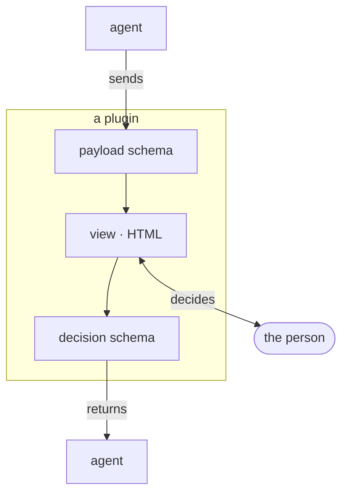
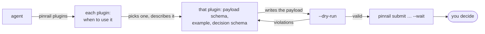

Every review in Pinrail belongs to a plugin. The plugin decides three things: what an agent may send, what the person sees, and what goes back. Pinrail supplies everything else: the inbox, notifications, history, and the command that the agent waits on.

## What a plugin is

A plugin is a folder with a manifest, two JSON Schemas and an HTML view.



- **The payload schema** is what the agent must send. Pinrail rejects anything else before it reaches your inbox.
- **The view** is what you decide in: a diff with proposed comments, a draft email to edit, a page to comment on.
- **The decision schema** is what goes back. The agent reads it as Markdown, a script reads it as JSON, and both can rely on its shape.

Data passes between the agent and Pinrail as JSON, and you see it in an HTML view. The agent never sees the view, and the view never talks to the agent.

## Why plugins

A plain approve-or-reject button gives an agent little to act on. A code review needs a verdict and a reason for each comment. An email needs edits to the draft itself. A page needs comments attached to its elements. Each kind of work needs a view designed for deciding it, and a decision that the agent can act on.

The agent's instructions decide when it asks, by naming the steps that need a person. The plugin decides what the question looks like and what the answer contains.

## How an agent finds the right plugin

A plugin describes itself, so an agent doesn't need you to explain it. Its manifest says what it is for and when to use it, and ships an example payload next to its schemas. The command `pinrail plugins` lists every installed plugin, one per line. The agent then reads the plugin it picks in full with `pinrail plugins describe <name>`:

```sh
pinrail plugins
```



- **Choosing.** The agent reads each plugin's *use when*, such as *You drafted emails on the person's behalf and need them approved before anything is sent*, and picks the one that fits the moment.
- **Writing the payload.** It starts from the example and follows the payload schema.
- **Checking before asking.** `pinrail submit … --dry-run` runs every check a real submission gets and creates nothing, so a malformed payload is fixed before it reaches you.
- **Reading the answer.** The decision schema says in advance what comes back, so the agent knows what to act on.

A plugin you install is ready for agents as soon as it is installed. Your instructions say when to ask, and the plugins describe how. See [Learning what to ask](/docs/agents/cli/#learning-what-to-ask) for the full output.

## The plugins that come with Pinrail

Five official plugins come with the app. The setup installs the two it recommends, `list` and `feedback`, and you install the others in *Settings › Plugins* or with `pinrail plugins install <name>`. A newer version arrives with an app update, and *Settings › Plugins* offers to update an installed plugin to it.

| Plugin | For |
|---|---|
| `list` | Items grouped under headings, each accepted or rejected with an optional note. The general-purpose choice for findings, tasks and proposed actions. |
| `feedback` | Questions an agent wants answered before it goes on: choices, free text and acknowledgments, grouped and conditional, answered in one pass. |
| `code-review` | A code review: the diff, the agent's proposed comments on the lines they concern, your verdicts and your own comments. |
| `image` | Generated images or illustrations, each large on a stage: pick a favourite, keep or drop the rest, and box or pin what to change. |
| `markdown` | A document an agent wrote, such as a plan or a spec, read with its diagrams and commented on with changes and questions. |

More official plugins, for emails, calendars, designed pages, logos and 3D models, are listed in [More plugins](/docs/plugins/more/).

## Writing your own plugin

Any work of your agents that needs a person can have a plugin of its own, for example approving a deploy, triaging alerts or choosing between three designs. A plugin is a few files, and an agent can write one as well as you can.

- [Writing a plugin](/docs/building/writing/) takes you from the first scaffold to a tested view.
- [Installing plugins](/docs/using/installing-plugins/) covers every source Pinrail installs from.
- [Publishing a plugin](/docs/building/publishing/) shares one as a release others install in one command.
