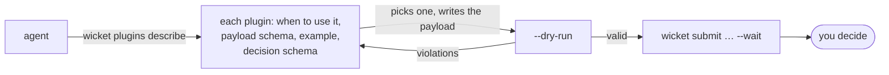

Every review in Wicket belongs to a plugin. The plugin decides three things: what an agent may send, what the person sees, and what goes back. Wicket supplies everything around them, the inbox, notifications, history, and the command the agent waits on.

## What a plugin is

A plugin is a folder with a manifest, two JSON Schemas and an HTML view.


- **The payload schema** is what the agent must send. Wicket rejects anything else before it reaches your inbox.
- **The view** is what you decide in: a diff with proposed comments, a draft email to edit, a page to comment on.
- **The decision schema** is what goes back. The agent reads it as markdown, a script reads it as JSON, and both can rely on its shape.

JSON is the transport and HTML is the view. The agent never sees the view, and the view never talks to the agent.

## Why plugins

A yes-or-no button tells an agent nothing. A code review needs verdicts on each comment, with reasons. An email needs edits to the draft itself. A page needs comments pinned to elements. Each kind of work deserves a view made for deciding it, and a decision shaped for acting on it.

The agent decides *when* to ask: its own instructions say which steps need a person. You decide *what asking looks like*: that is the plugin.

## How an agent finds the right plugin

A plugin describes itself, so an agent doesn't need you to explain it. Its manifest says what it is for and when to use it, and ships an example payload next to its schemas. An agent learns everything installed with one command:

```sh
wicket plugins describe --format markdown
```



- **Choosing.** The agent reads each plugin's *use when*, such as *You drafted emails on the person's behalf and need them approved before anything is sent*, and picks the one that fits the moment.
- **Writing the payload.** It starts from the example and follows the payload schema.
- **Checking before asking.** `wicket submit … --dry-run` runs every check a real submission gets and creates nothing, so a malformed payload is fixed before it reaches you.
- **Reading the answer.** The decision schema says in advance what comes back, so the agent knows what to act on.

A plugin you install is ready for agents as soon as it is installed. Your instructions still say *when* to ask; the plugins explain *how*. See [Learning what to ask](/docs/agents/cli/#learning-what-to-ask) for the full output.

## The plugins that come with Wicket

Two plugins are built into the app and always available:

| Plugin | For |
|---|---|
| `list` | Items grouped under headings, each accepted or rejected with an optional note. The general-purpose choice for findings, tasks and proposed actions. |
| `feedback` | Questions an agent wants answered before it goes on: choices, free text and acknowledgments, grouped and conditional, answered in one pass. |

Six more ship as samples, to install or to learn from:

| Plugin | For |
|---|---|
| `review` | A code review: the diff, the agent's proposed comments on the lines they concern, your verdicts and your own comments. |
| `email` | Emails an agent wants to send: edit them with the changes showing, comment on a passage, and send, revise or discard each one. |
| `artifact` | An HTML page an agent designed: pick elements the way browser developer tools do, comment on them, and the agent gets the selectors back. |
| `calendar` | Times to arrange around what is already booked: one suggested slot per item, with conflicting suggestions stepping aside, or the item left for the agent. |
| `logo` | Candidate logo marks, seen at every size, as app icons and in a menu bar: pick a favourite, keep or drop the rest, and ask for changes to parts of a mark. |
| `hello` | The smallest complete plugin: one yes-or-no question with a comment. A starting point to copy from. |

## Your own

Anything your agents do that needs a person can have a plugin of its own: approving a deploy, triaging alerts, choosing between three designs. A plugin is a few files, and an agent can write one as well as you can.

- [Writing a plugin](/docs/building/writing/) takes you from the first scaffold to a tested view.
- [Installing plugins](/docs/using/installing-plugins/) covers every source Wicket installs from.
- [Publishing a plugin](/docs/building/publishing/) shares one as a release others install in one command.
