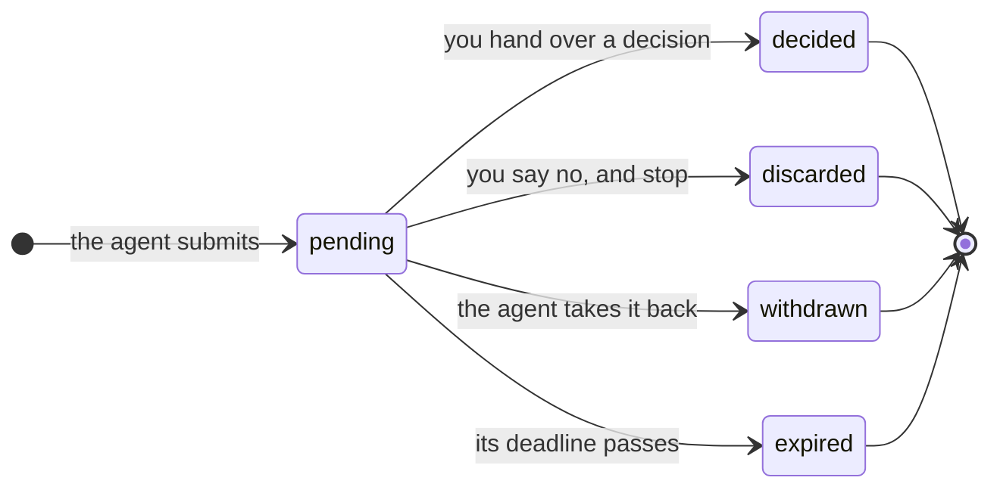
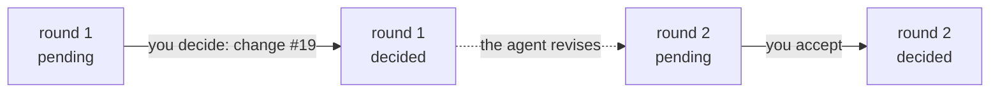

A review is one question from an agent to you: *here is what I'm about to do, what do you say?* It carries the work to decide on, it waits in your inbox, and it ends with an outcome the agent can act on.

## What a review holds

| Part | What it is |
|---|---|
| **Title** | What the review is about, as it appears in your inbox. |
| **Plugin** | The kind of review: [List](/docs/plugins/list/), [Code review](/docs/plugins/review/), and so on. It decides the view and the shape of the decision. |
| **Payload** | The work to decide on: the items, the diff, the drafts. Checked against the plugin's schema when the review is created. |
| **Files** | For a plugin that takes them, files sent beside the payload: a model, a PDF, photos. Stored with the review, and deleted with it. |
| **Origin** | Where it comes from: a repository, a workflow, a run, a branch or pull request, a link. The inbox groups and filters by it. |
| **Requester** | Who is asking, such as an agent's name or a CI job. |
| **Decision** | Your answer, once you give it, and your note to the agent beside it. |

## How a review ends

Every review starts **pending** and ends exactly one way.

| Outcome | Who | What the agent gets |
|---|---|---|
| **Decided** | You | Your decision and your note. The waiting command exits `0`. |
| **Discarded** | You | Your reason, and an instruction to stop the work. Exit `5`. |
| **Withdrawn** | The agent | Nothing to act on: it asked, then changed its mind. Exit `3`. |
| **Expired** | Nobody | The review had a deadline and nobody decided in time. Exit `3`. |

An ended review never changes again. It moves from the inbox to your history, read-only, still showing the view it was decided in.

### Deciding and discarding

**Deciding** is a considered answer: accept this, reject that, change these words. Whatever the plugin lets you say, you say it, and the agent acts on it.

**Discarding** is different: it means *no, and stop*. Use it when the whole thing is wrong, not worth doing, or not wanted now. You can give a reason, which goes to the agent. A discarded review has no decision, and an agent that is told it was discarded should stop the work it was asking about rather than try again.

## Rounds

Often your answer is *nearly*: keep this, change that. The agent makes the changes and asks again, submitting a new review that **revises** the first. That is a new round.

- In the app, a new round shows your previous verdicts beside each item, so you can see what changed and only look again where you need to.
- <kbd>[</kbd> and <kbd>]</kbd> step between rounds of the same review.
- Every round is kept. Each is its own review with its own outcome, linked to the one it revises.

An agent submits a new round with `--revises <id>`. See [Instructing an agent](/docs/agents/instructing/#rounds).

## Your note to the agent

Besides the plugin's decision, every hand-over can carry a note to the agent: context that belongs to the review as a whole rather than to any one item. The agent receives it with the decision, and it is shown in your history.
