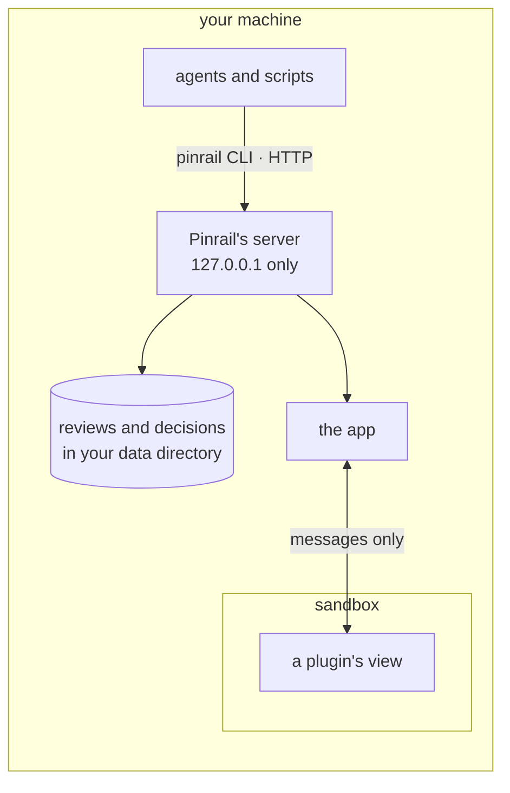

Pinrail sits between your agents and the things they do, so it matters what it can reach. This page lists what runs where, and what each part is allowed to do.

## Everything is on your machine

- **The server** listens on your machine's loopback address, `127.0.0.1`, port `4747` by default. Programs on your computer can reach it, but nothing on the network can. Web pages you visit cannot reach it either. It answers only requests addressed to `127.0.0.1` or `localhost`. It changes nothing unless the request is JSON, and browsers do not let another site send JSON to it.
- **Reviews and decisions** are stored in your data directory, `~/.local/share/pinrail` by default, with the files sent beside reviews. Pinrail makes that directory readable only by your user account, so other users of the computer cannot read your reviews. There is no account and no cloud service.
- **The app** shows reviews and sends your decisions. Nothing leaves your machine unless an agent, acting on your decision, sends it.

## What a plugin's view can do

A plugin's view is a page the app shows inside a sandboxed frame. However the plugin was installed, the view:

- **can** draw, and exchange [messages](/docs/building/protocol/) with the app;
- **can** ask the app to open a link in your browser, when you click one;
- **cannot** use the network: no requests, no web fonts, no scripts or styles from elsewhere;
- **cannot** store anything, or read anything the app does not hand it: the files its review carries come from the app when the view asks for one by name, and those of no other review;
- **cannot** see other reviews, other plugins, or your files.

Everything a view shows arrives in the review's payload, or in the files beside it. That is why a code review sends the diff rather than a link to it.

Files that an agent attaches to a review are only displayed inside a view's sandbox, whatever they contain. The view asks the app for a file's contents and displays it itself; the artifact plugin, for example, displays an attached HTML page this way. The app itself never opens an attachment: it lists each one by name and size, and saving one writes its contents to disk unchanged.

## What installing a plugin runs

Installing is where code from someone else can run on your machine, and it depends on the source.

| You install from | What runs |
|---|---|
| A **GitHub release** | Nothing. Pinrail downloads the prebuilt bundle and serves it. |
| A **folder or repository** without a build | Nothing. Pinrail copies the files. |
| A **folder or repository** that declares a build | The build command, such as `npm ci && npm run build`, on your machine, as you. |

:::caution[A build is code you run]
`npm ci` runs the install scripts of every package in the dependency tree, and the build runs whatever the plugin's package says. Pinrail shows you the exact command before anything runs, and runs it only when you confirm. Releases are not signed and publishers are not vetted: install plugins from people and repositories you would run code from.
:::

Once installed, a built plugin is just files: its view runs in the same sandbox as any other.

## What the agent can do

Pinrail does not run your agents or limit what they do. It gives them a way to ask, and it reports your answer faithfully. Whether an agent asks, and whether it respects the answer, is up to its instructions and its harness. Write instructions that name the moments to ask, and prefer tools that enforce them. See [Instructing an agent](/docs/agents/instructing/).
