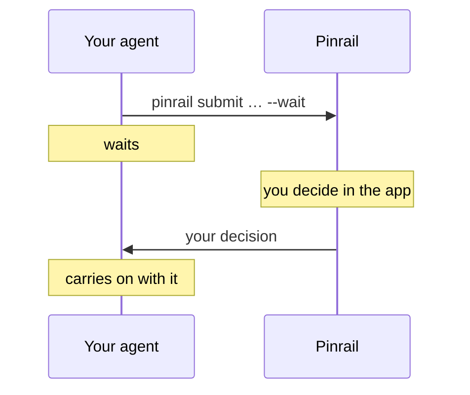

The quickest way to see Pinrail at work is to have your agent ask you something. Once Pinrail's skill is connected to the agent, a request in your own words is enough: the skill tells the agent how to submit a review and how to read your decision.



## Before you start

- Pinrail is running. See [Install](/docs/getting-started/install/).
- Your agent has Pinrail's skill. The setup's *Connect* step adds it, and so does *Connect* in [Settings › Agents](/docs/using/settings/#agents).
- The [List](/docs/plugins/list/) plugin is installed. The setup installs it, and `pinrail plugins install list` installs it later.

## 1. Ask your agent

Open your agent in one of your projects, such as Claude Code in a repository, and give it this request:

```txt wrap
Ask me through Pinrail which TODOs in this repository to tackle first.
```

The agent finds the TODOs, puts them in a list review, and submits it with the `pinrail` command. Then it waits for your decision.

## 2. Decide

Pinrail notifies you, and the review is waiting at the top of your inbox. Open it:

- **Accept** the TODOs you want done first, and add a note to one of them, such as "and add a test for it".
- **Reject** one, with a reason.
- Press **Hand over**, or <kbd>⌘↵</kbd>.

:::tip
Leave an item without a verdict to see what happens: the app asks you to confirm, and the agent is told that the item is undecided.
:::

## 3. The agent carries on

Your decision reaches the agent as soon as you hand it over. The agent starts on the TODOs you accepted, follows your notes, and leaves the rejected ones alone.

If you **discard** the review instead, with the *Discard* button at the right of its header, the agent is told to stop the work the review was about, and is given your reason.

## More to try

Each official plugin is a different kind of review. Give your agent one of these requests to see the others. The setup's *Try it* step offers the same requests, with a button to copy each one.

| Plugin | Request |
|---|---|
| [Feedback](/docs/plugins/feedback/) | Ask me through Pinrail what you need to know before the next task. |
| [Code review](/docs/plugins/code-review/) | Review my last commit, and send me your comments on my changes through Pinrail. |
| [Markdown](/docs/plugins/markdown/) | Plan the next change, and ask me through Pinrail to review the plan. |
| [Image](/docs/plugins/image/) | Make three versions of an icon for this project, and ask me through Pinrail which to keep. |

Install a plugin first if the setup did not: `pinrail plugins install feedback`, for example.

## Ask your agent for ideas

The skill also tells your agent which plugins are installed and what each one is for, so the agent can suggest where Pinrail fits in your work:

```txt wrap
Look at this project and suggest where you should ask me through Pinrail before you act, and which plugin you would use each time.
```

When you like a suggestion, make it part of the agent's instructions, so that it asks every time without being reminded. [Instructing an agent](/docs/agents/instructing/) shows how.

## What the agent runs

The agent does all of this with the `pinrail` command. You can run the same steps yourself, to see exactly what an agent sends and what it gets back.

:::tip[To send a sample review]
`pinrail submit list --sample --wait` sends the List plugin's own sample and waits for your decision, in one command.
:::

### The payload

Every review belongs to a plugin, and its payload is JSON in the shape that the plugin describes. `pinrail plugins describe list` prints the List plugin's schema and an example. A list review of two items looks like this:

```json title="triage.json"
{
  "summary": "Sentry triage for **acme-api**, last 7 days.",
  "groups": [
    {
      "title": "acme-api",
      "items": [
        {
          "id": 101,
          "severity": "blocker",
          "title": "Ecto.StaleEntryError in Tickets.close/1 (312×)",
          "body": "Two workers close the same ticket; the second update hits a stale row."
        },
        {
          "id": 102,
          "severity": "minor",
          "title": "Mute the flaky image resize timeout",
          "body": "Only on the staging worker."
        }
      ]
    }
  ]
}
```

### The command

```sh
pinrail submit list --title "Sentry triage" --data triage.json --wait
```

The command prints the review's id, then waits until you decide in the app.

### The decision

When you hand the review over, the command prints your decision as Markdown:

```md
r_01K5… · decided · Sentry triage
list · decided by alice at 2026-09-23 10:14

## acme-api

- **#101 accepted** — Ecto.StaleEntryError in Tickets.close/1 (312×) (blocker)
  > and add a test for the race
- **#102 rejected** — Mute the flaky image resize timeout (minor)
  > it's flaky on production too, fix it instead
```

The command exits with code `0` when the review is decided, and with code `5` when you discard it. A script can ask for JSON instead and branch on it. See [Scripts and CI](/docs/agents/workflows/) and [The CLI](/docs/agents/cli/).

## Next

- [Instructing an agent](/docs/agents/instructing/): tell your agent when to ask, so that it asks without being reminded.
- [Plugins](/docs/plugins/): what each plugin shows, and a block of instructions ready to paste.
