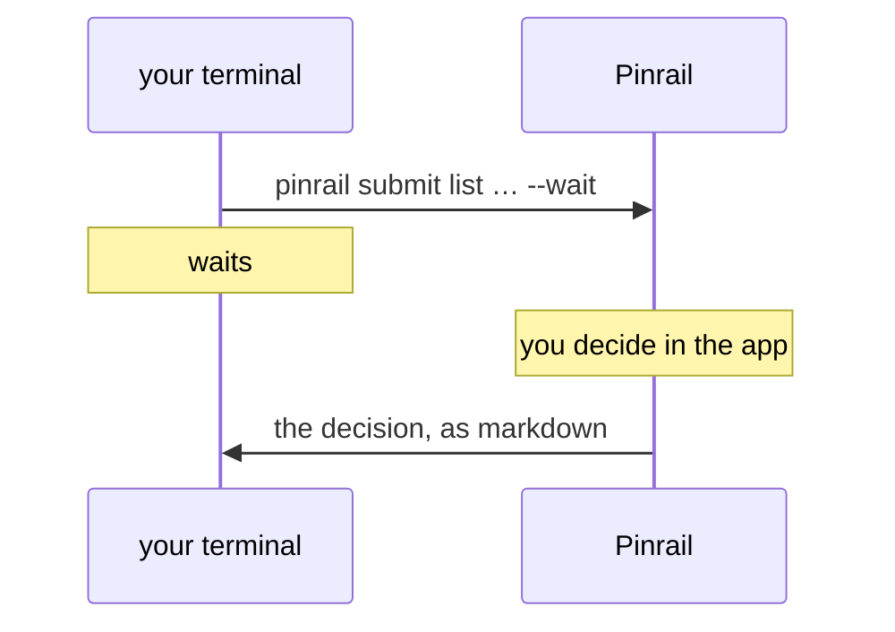

The quickest way to understand Pinrail is to be the agent for a minute. You will send a review from your terminal, decide it in the app, and read back what an agent would receive.



:::tip[Only want to see one?]
`pinrail submit list --sample --wait` sends the list plugin's own sample and waits for your decision, all in one line. The steps below do the same with a payload you write, which is what an agent does.
:::

## 1. Write a payload

Every review belongs to a plugin. The built-in [List](/docs/plugins/list/) plugin shows items grouped under headings and asks for a verdict on each. Save this as `triage.json`:

```json title="triage.json"
{
  "intro": "Sentry triage for **acme-api**, last 7 days.",
  "groups": [
    {
      "title": "acme-api",
      "items": [
        {
          "id": 101,
          "severity": "blocker",
          "title": "Ecto.StaleEntryError in Tickets.close/1 (312×)",
          "body": "Two workers close the same ticket; the second update hits a stale row."
        },
        {
          "id": 102,
          "severity": "minor",
          "title": "Mute the flaky image resize timeout",
          "body": "Only on the staging worker."
        }
      ]
    }
  ]
}
```

## 2. Ask

```sh
pinrail submit list --title "Sentry triage" --data triage.json --wait
```

The command reports that the review was submitted, then waits for your decision. An agent's command does exactly this when it asks you something.

## 3. Decide

Pinrail notifies you, and the review is waiting at the top of your inbox. Open it:

- **Accept** the first item and add a note, such as "and add a test for the race".
- **Reject** the second, with a reason.
- Press **Hand over**, or <kbd>⌘↵</kbd>.

:::tip
Leave an item without a verdict to see what happens: the app asks you to confirm, and the item comes back as undecided.
:::

## 4. Read the decision

Back in your terminal, the command has returned:

```md
r_01K5… · decided · Sentry triage
list · decided by alice at 2026-09-23 10:14

## acme-api

- **#101 accepted** — Ecto.StaleEntryError in Tickets.close/1 (312×) (blocker)
  > and add a test for the race
- **#102 rejected** — Mute the flaky image resize timeout (minor)
  > it's flaky on production too, fix it instead
```

An agent reads this and carries on: it fixes the first item as you asked, and leaves the second. A script would ask for JSON instead and branch on it. See [Scripts and CI](/docs/agents/workflows/).

The command exited with `0`, which means the review was decided. Try it again and **discard** the review instead, with the *Discard* button in its bar: the command exits with `5`, the signal for "no, and stop".

## Next

Now let an agent do the asking. [Instructing an agent](/docs/agents/instructing/) shows what to put in its instructions, and each [plugin page](/docs/plugins/) has a block ready to paste.
