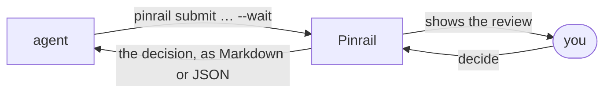

Pinrail is the inbox where your agents ask before they act. An agent about to do something that matters, such as posting review comments, sending email or shipping a page, submits a review and waits. You decide in a view made for that kind of question, and the agent carries on with your decision.

## Where to start

| If you want to… | Read |
|---|---|
| Install Pinrail and see your first review | [Getting started](/docs/getting-started/install/) |
| Choose a plugin for what your agent does | [Plugins](/docs/plugins/) |
| Tell your agent when to ask | [Instructing an agent](/docs/agents/instructing/) |
| Ask a person before a step in a script or a CI job | [Scripts and CI](/docs/agents/workflows/) |
| Build a plugin for your own kind of review | [Writing a plugin](/docs/building/writing/) |

## How it works

The agent's own instructions say which steps need you. Each kind of review is a [plugin](/docs/concepts/plugins/): it defines what the agent sends, the view you decide in, and the decision that goes back. Everything stays on your machine.
