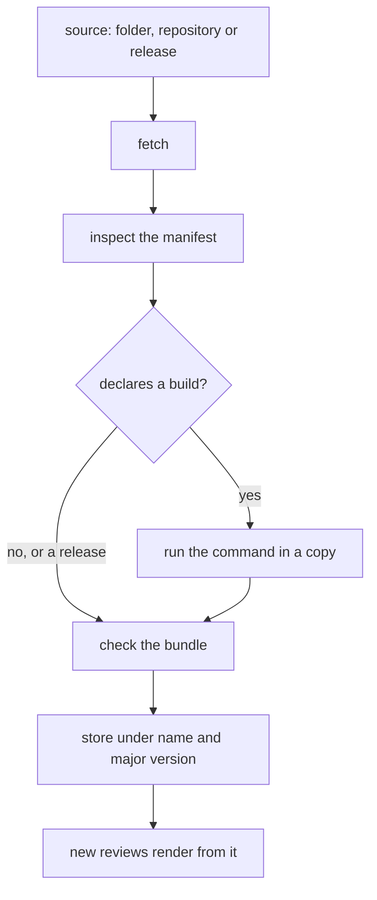
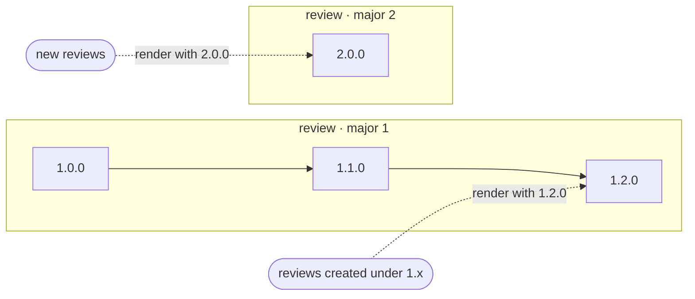

Pinrail installs one plugin at a time, from the app or from the command line. You give Pinrail a source (a folder, a Git repository or a GitHub release), and it shows you what it found before it installs anything.

## From the app

Open *Settings › Plugins* and choose *Install…*. Paste a source, or choose a folder, then choose *Inspect*. Pinrail fetches the source and shows you:

- the plugin the manifest describes, and its version;
- where it comes from;
- whether a build runs, and the exact command;
- what is already installed under the same name.

To serve a folder live while you work on it, turn on *Link instead of copying*. Choose *Install*, or *Link*, to confirm. Nothing is copied or run before that.


## From the command line

```sh
pinrail plugins install <source>
```

The form of the source tells Pinrail where to fetch the plugin from:

| Source | Installs |
|---|---|
| `./plugins/review` | A folder on this machine, copied into the app. |
| `./plugins/review --link` | The same folder, served directly while you work on it. |
| `github.com/acme/plugins/review@v3` | A folder inside a repository, at a tag. |
| `https://github.com/acme/plugins/tree/v3/review` | The same, as your browser shows it. |
| `github.com/acme/pinrail-review` | A repository's root, on its default branch. |
| `git@acme.internal:plugins.git --ref v3 --path review` | Any git remote over SSH, with the ref and folder given separately. |
| `https://github.com/acme/pinrail-review/releases` | The latest GitHub release: its prebuilt bundle, with no build. |
| `https://github.com/acme/pinrail-review/releases/tag/v1.2.0` | That release, pinned. |

A ref is a branch, a tag or a commit. Without one, Pinrail uses the default branch. GitLab's `/-/tree/<ref>/<folder>` URLs work the same way as GitHub's.

When the plugin declares a build, the command prints the exact build command and asks you to confirm it before anything runs. The `--yes` option confirms the build in advance, for a script or an agent's session where nobody can answer the question. Without `--yes`, and with nobody at a terminal to answer, the install is refused and nothing runs.

Pinrail installs exactly what it showed you: the same commit of a repository, the same release asset, and the same build command. If the source changes between the check and the install, the install is refused before anything runs, and you install again to see the new version.

:::tip[Prefer releases]
A release carries a prebuilt bundle, so installing it needs no toolchain and runs nothing on your machine. See [Publishing a plugin](/docs/building/publishing/).
:::

## What an install does



1. **Fetch.** Pinrail copies the folder, clones the repository at the ref, or downloads the release's bundle.
2. **Build, when declared.** A plugin written with a framework declares its build in the manifest, for example `"build": { "command": "npm ci && npm run build" }`. Pinrail runs it through the shell in a copy of the source, without `node_modules` or `.git`, shows the output as it runs, and keeps the log. A non-zero exit stops the install and shows the end of the log. The tools the command needs, such as `node` or `pnpm`, must be on your `PATH`.
3. **Check.** The manifest, the schemas and the entry must be valid. A manifest without `build` whose entry file is missing is refused, with the reason.
4. **Store.** Only the bundle is kept: `src/`, `tests/`, `fixtures/`, `node_modules/`, dot-files and package and tool configuration stay behind. The copy is stored under the plugin's name and major version, hashed and recorded with where it came from.

## Versions and updates

Plugin versions are semantic, such as `"1.2.0"`. The major version is a compatibility promise, and Pinrail keeps one line per major.



- **A newer minor or patch** replaces the copy in place. Every review created under that major renders with it, so it gets the fixes.
- **An older version** is refused unless you pass `--force`.
- **A new major** is installed beside the old one. The old line stays for as long as a review still renders from it.

Check for updates from the plugin's row in *Settings › Plugins*, or from the command line:

```sh
pinrail plugins update            # every installed plugin
pinrail plugins update review     # one plugin
```

An update that runs a build shows the build command first, in the app and on the command line, and runs it only when you confirm. On the command line, `--yes` confirms it in advance. When nobody can confirm, a plugin whose update runs a build is not updated, and the command reports it as failed.

A plugin installed from a repository at a tag or a commit, or from a release whose tag is only a version such as `v1.2.0`, is pinned. The update check reports that it is pinned and does not move it. A release whose tag names the plugin, such as `review-v1.2.0`, is not pinned: the update check follows newer releases of the same plugin. `pinrail plugins versions review` lists the versions reviews can still render with.

## Developing with a linked folder

A linked plugin is served straight from your folder, so a change shows the next time you open one of its reviews, with no reinstall:

```sh
pinrail plugins install ./ticket_triage --link
```

Reviews of a linked plugin render from the folder as it is now. If you remove the link, its reviews show that the plugin is not installed until you install it again. When you are done iterating, choose *Install a copy* on the plugin's row to keep the current state.

After editing the manifest or a decision template, reload so the app reads them again:

```sh
pinrail plugins reload
```

## Removing a plugin

```sh
pinrail plugins remove ticket_triage
```

Removing a plugin stops new reviews from using it. Stored copies that existing reviews still render from are kept, so your history stays readable.

## What runs on your machine

:::caution[A build runs code with your user permissions]
When you install a plugin from a source that needs a build, Pinrail runs the build command on your computer with your user's permissions. Installing a release does not run anything. Only install plugins from people and repositories whose code you would be willing to run. [What runs where](/docs/concepts/trust/#what-installing-a-plugin-runs) explains what each kind of installation runs.
:::

## Where plugins live

Under the app's data directory, `plugins/` holds three folders:

| Folder | Contents |
|---|---|
| `store/<name>/<major>/` | The installed copies. |
| `fetch/` | Scratch space an install uses and empties. |
| `logs/` | The last few build logs of each plugin. |
