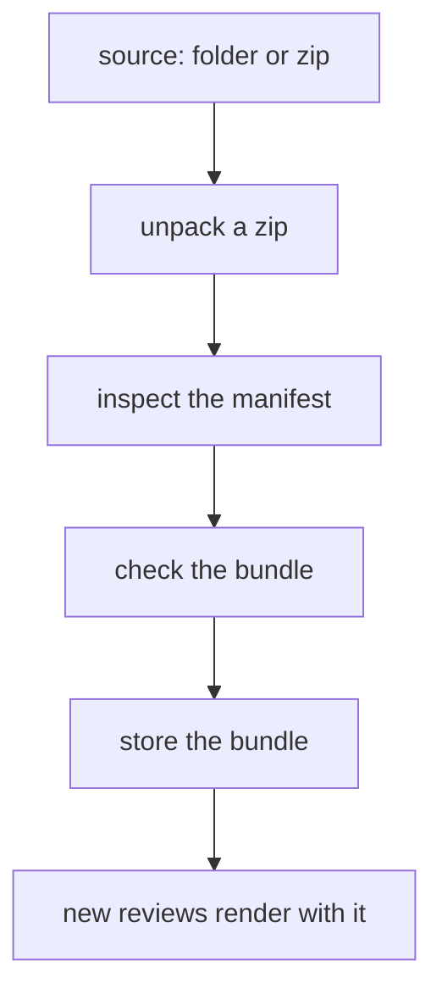
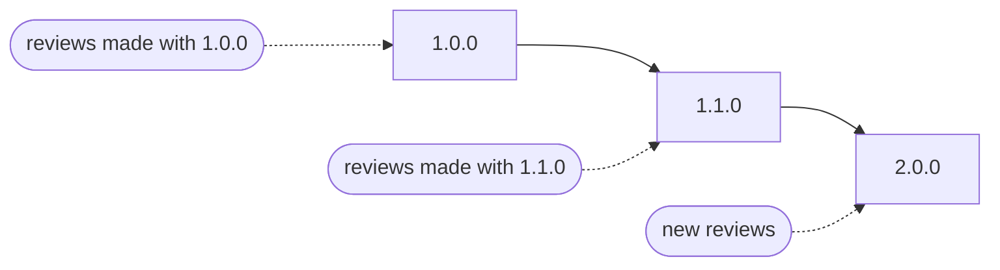

Pinrail installs one plugin at a time, from the app or from the command line. You give Pinrail a source, which is a plugin's folder or a zip of it on your computer, and it shows you what it found before it installs anything.

## From the app

Open *Settings › Plugins* and choose *Install…*. Paste the path of a folder or a zip, or choose a folder, then choose *Inspect*. Pinrail shows you:

- the plugin the manifest describes, and its version;
- where it comes from;
- what is already installed under the same name, and whether this version is older.

To serve a folder live while you work on it, turn on *Link instead of copying*. Choose *Install*, or *Link*, to confirm. Nothing is copied before that.


## From the command line

```sh
pinrail plugins install <folder or zip>
```

| Source | Installs |
|---|---|
| `./plugins/review` | A folder on this machine, copied into the app. |
| `./plugins/review --link` | The same folder, served directly while you work on it. |
| `~/Downloads/review-1.2.0.zip` | A zip of a plugin, such as one attached to a release. |

To install a plugin that is published on a website, download its zip first, then install the zip.

## What an install does



1. **Unpack.** A zip is unpacked into a scratch folder. Its manifest can be at the top of the zip, or inside the one folder at the top.
2. **Check.** The manifest, the schemas and `view/index.html` must be valid. A folder without `view/index.html` is usually a plugin whose view is built by a tool such as Vite, and it is refused with a message that says to build it first.
3. **Store.** Only the bundle is kept: `manifest.json`, `icon.svg`, `README.md`, `LICENSE` and the folders `schemas/`, `view/`, `templates/` and `samples/`, without hidden files. Everything else, such as sources, tests, fixtures and `node_modules/`, stays behind. The bundle is stored once, named by the hash of its files, and becomes the version new reviews use. Pinrail records where it came from.

Installing runs nothing on your computer and connects to nothing.

## Plugin names

A plugin is known by the `name` in its manifest, such as `review`. Agents, commands, settings and reviews all use that name. Where a plugin came from, a folder, a zip or the app itself, is shown on its row but is not part of its name.

One plugin is installed under each name. Installing a plugin under a name that is already installed replaces what is there, and the install dialog says what it replaces before you confirm. This also applies to the plugins that come with Pinrail: a plugin you install under the name `list` takes the place of Pinrail's own.

The plugin's settings belong to its name, so they stay when you install a new version. The sites it may open without asking also stay when you install it again from a folder or a zip. They do not carry over between the copy that comes with Pinrail and a plugin from disk under the same name, because that name then means another plugin.

## Versions and upgrades

Plugin versions are semantic, such as `"1.2.0"`. A review keeps the version it was submitted to, and always renders and validates with it. An upgrade is for new reviews, so it never changes a review already made, and a decided review shows what you saw when you decided.



To upgrade a plugin, install the new version from its folder or its zip. The new version replaces the installed one for new reviews.

- **A newer version** replaces the installed one.
- **An older version** also replaces it. The install dialog says that the version is older before you install it, and the command line says so afterwards, for example *Replaced review 1.3.0 with the older 1.2.0*.
- **A version is kept** for as long as a review made with it is kept.

## Developing with a linked folder

A linked plugin is served straight from your folder, so a change shows the next time you open one of its reviews, with no reinstall:

```sh
pinrail plugins install ./ticket_triage --link
```

Reviews of a linked plugin render from the folder as it is now. Each review also keeps the folder as it was when the review was submitted, so once you remove the link, it renders with that. When you are done iterating, choose *Install a copy* on the plugin's row to keep the current state.

Pinrail stores a linked folder again whenever it changes: when an agent describes the plugin or submits a review to it after a change, and when it checks the folder, which it does every second. A change to the manifest, a schema or the decision template therefore applies without a reload, and a submission is always checked against the folder as it is. A folder with a mistake, such as a manifest that does not parse, is refused when it is used, with the reason, and the reason shows on the plugin's row until you fix it. Until then, the plugin keeps the last version of the folder that worked.

A linked folder must not contain symbolic links, as for any install.

### Working on a plugin that comes with Pinrail

To change one of the plugins that come with Pinrail, link your copy of it under the same name:

```sh
pinrail plugins install ./list --link
```

The link takes the plugin's place, so its reviews render with your folder. Removing the link removes the installation, and Pinrail installs its own copy again the next time it starts.

## Removing a plugin

```sh
pinrail plugins remove ticket_triage
```

Removing a plugin stops new reviews from using it. Existing reviews keep the versions they were made with, so your history stays readable. The plugins that come with Pinrail cannot be removed.

## What runs on your machine

Installing a plugin runs nothing on your computer: Pinrail copies the plugin's files into its store and checks them. The plugin's view runs later, in a sandboxed frame, when you open one of its reviews. [What runs where](/docs/concepts/trust/#what-installing-a-plugin-runs) explains what a plugin can and cannot do.

## Where plugins live

Under the app's data directory, `plugins/` holds two folders:

| Folder | Contents |
|---|---|
| `bundles/<hash>/` | The installed versions, each stored once and never changed. |
| `work/` | Scratch space where a zip is unpacked during an install. |
