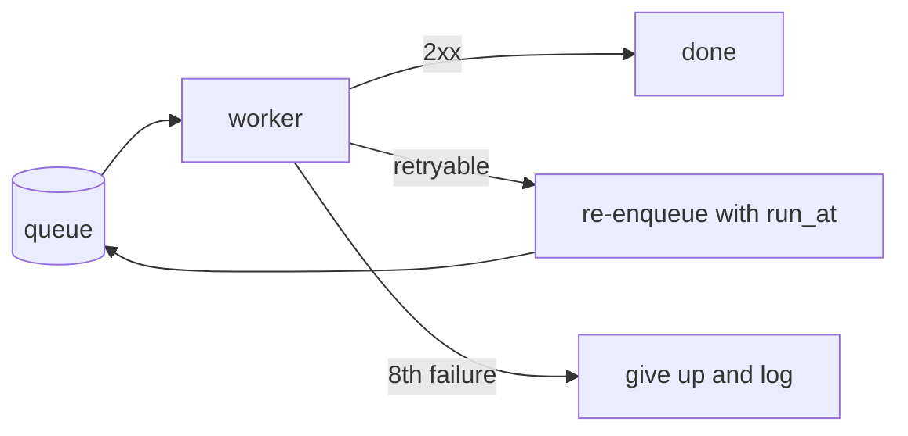

# Retry policy for webhook deliveries

How the delivery worker retries a webhook that fails, and when it gives up.

## Goals

- A slow customer endpoint must not stall other deliveries.
- A delivery is tried at most eight times over about an hour.
- Every give-up is logged with the last status.

## Design

The worker takes a delivery from the queue and posts it once. A failure
re-enqueues the delivery with a `run_at` in the future instead of sleeping.



### Backoff

| Attempt | Delay |
|---|---|
| 1 | 1 s |
| 2 | 2 s |
| 3 | 4 s |
| 8 | 128 s |

Jitter of up to 20 % spreads retries from many workers.

```ts
const delay = Math.min(2 ** attempt, 128) * (0.8 + Math.random() * 0.4);
```

## Open questions

1. Should a `Retry-After` header override the backoff?
2. Do we alert on a customer whose deliveries all fail?
